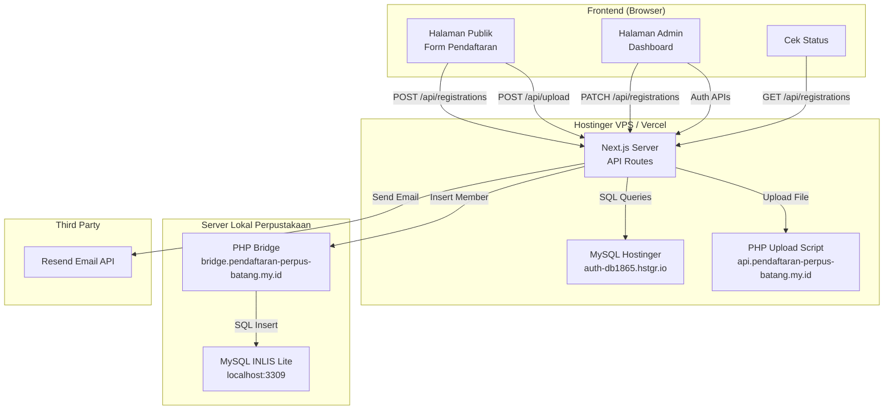
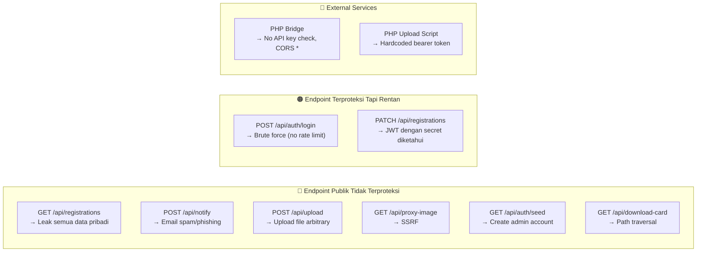

# 🔒 Analisis Keamanan Web — Pendaftaran Perpus Batang

> **Tanggal Analisis**: 17 Juni 2026  
> **Scope**: Full codebase + deployment ecosystem  
> **Metode**: Static code review (tanpa modifikasi kode)

---

## 1. Arsitektur & Ekosistem Sistem

### Teknologi Stack

| Komponen | Teknologi | Versi |
|----------|-----------|-------|
| Framework | Next.js (App Router) | 16.2.4 |
| Runtime | React | 19.2.4 |
| Database Online | MySQL (Hostinger) | - |
| Database Lokal | MySQL (INLIS Lite via XAMPP) | Port 3309 |
| Auth | JWT (jose) + bcryptjs | jose 6.2.3 |
| Email | Resend API | 6.12.3 |
| ORM | mysql2 (raw queries) | 3.22.3 |
| PDF Generator | @react-pdf/renderer | 4.5.1 |
| Barcode | bwip-js | 4.10.1 |
| Styling | TailwindCSS | v4 |

### Diagram Arsitektur Deployment



### Alur Data Utama

1. **Pendaftaran Publik**: User → Form → Upload foto ke Hostinger PHP → Simpan data ke MySQL Hostinger
2. **Approve Admin**: Admin → PATCH API → Next.js call PHP Bridge → Insert ke INLIS Lite lokal → Update status di Hostinger
3. **Cek Status**: User → GET API dengan ticket_no → Tampilkan status + kartu digital

---

## 2. Temuan Keamanan

### Ringkasan Severity

| Level | Jumlah | Deskripsi |
|-------|--------|-----------|
| 🔴 **CRITICAL** | 5 | Harus segera diperbaiki — risiko eksploitasi langsung |
| 🟠 **HIGH** | 6 | Penting diperbaiki — berdampak signifikan |
| 🟡 **MEDIUM** | 5 | Sebaiknya diperbaiki — praktik terbaik keamanan |
| 🔵 **LOW** | 4 | Peringatan minor — peningkatan kualitas |

---

### 🔴 CRITICAL #1 — Hardcoded Secrets & Credentials di Source Code

> [!CAUTION]
> **Semua kredensial sensitif terekspos sebagai fallback hardcoded di banyak file.**

**Lokasi Temuan**:

| File | Baris | Secret Yang Terekspos |
|------|-------|-----------------------|
| [middleware.ts](file:///d:/project/pendaftaran-perpus-batang/middleware.ts#L13) | 13, 31 | JWT Secret: `super_secret_jwt_key_dispuspa_batang_2026_xyz123` |
| [login/route.ts](file:///d:/project/pendaftaran-perpus-batang/app/api/auth/login/route.ts#L40) | 40 | JWT Secret (sama) |
| [me/route.ts](file:///d:/project/pendaftaran-perpus-batang/app/api/auth/me/route.ts#L14) | 14 | JWT Secret (sama) |
| [change-password/route.ts](file:///d:/project/pendaftaran-perpus-batang/app/api/auth/change-password/route.ts#L16) | 16 | JWT Secret (sama) |
| [profile/route.ts](file:///d:/project/pendaftaran-perpus-batang/app/api/admin/profile/route.ts#L17) | 17, 67 | JWT Secret (sama) |
| [users/route.ts](file:///d:/project/pendaftaran-perpus-batang/app/api/admin/users/route.ts#L15) | 15 | JWT Secret (sama) |
| [constants.ts](file:///d:/project/pendaftaran-perpus-batang/lib/constants.ts#L2-L3) | 2-3 | Admin Username: `admin.perpus` & Password: `Dispuspa@2026` |
| [seed/route.ts](file:///d:/project/pendaftaran-perpus-batang/app/api/auth/seed/route.ts#L14-L15) | 14-15 | Default admin email & password hardcoded |
| [upload/route.ts](file:///d:/project/pendaftaran-perpus-batang/app/api/upload/route.ts#L27) | 27 | Upload API key: `dispuspa-batang-upload-secret-key-2026` |
| [registrations/route.ts](file:///d:/project/pendaftaran-perpus-batang/app/api/registrations/route.ts#L182) | 182 | Bridge API key fallback: `dispuspa-batang-secret-2026` |
| [reset_password.mjs](file:///d:/project/pendaftaran-perpus-batang/reset_password.mjs#L15) | 15 | Hardcoded password reset: `Dispuspa@2026` |

**Dampak**: Jika kode source pernah bocor (via Git public, error page, atau akses file), **semua autentikasi bisa di-bypass**. Penyerang bisa memalsukan JWT token valid dengan secret yang diketahui.

**Pola masalah**: Penggunaan `process.env.JWT_SECRET || 'super_secret_jwt_key...'` — jika env var tidak ter-set, fallback langsung aktif di production.

---

### 🔴 CRITICAL #2 — `.env.local` Berisi Kredensial Produksi Lengkap

> [!CAUTION]
> **File `.env.local` berisi seluruh kredensial database produksi, API keys, dan secret keys.**

**Lokasi**: [.env.local](file:///d:/project/pendaftaran-perpus-batang/.env.local)

| Baris | Kredensial Terekspos |
|-------|---------------------|
| 12 | Resend API Key: `re_eWaYdnWk_6MvSMoULWrFMc7RW3LPjFwwj` |
| 18-22 | DB Host: `auth-db1865.hstgr.io`, User: `Disperpuska`, Pass: `DisperpuskaBatang2026` |
| 23 | JWT Secret produksi |
| 24 | Bridge Secret: `mega_secret_key_dispuspa_batang_2026_54321` |
| 59 | Bridge API Key: `dispuspa-batang-secret-2026` |

Walau `.gitignore` sudah mengeliminasi `.env*`, **risiko tetap ada** jika:
- Repository pernah commit file ini sebelum `.gitignore` aktif
- File terbaca oleh error page atau debug tool
- File diakses oleh malware lokal

> [!IMPORTANT]
> Selain itu, ada **Supabase keys yang di-comment** di baris 2-4 yang juga berisi JWT credential asli — meskipun sudah tidak aktif, tetap merupakan kebocoran informasi.

---

### 🔴 CRITICAL #3 — Endpoint Seed API Terbuka Tanpa Proteksi

> [!CAUTION]
> **Endpoint `/api/auth/seed` bisa diakses oleh siapapun melalui GET request.**

**Lokasi**: [seed/route.ts](file:///d:/project/pendaftaran-perpus-batang/app/api/auth/seed/route.ts)

```
GET /api/auth/seed → Membuat akun superadmin baru jika tabel kosong
```

**Masalah**:
- **Tidak ada autentikasi** — siapapun bisa mengakses
- Endpoint **tidak dilindungi middleware** (hanya memeriksa apakah tabel admin_users sudah terisi)
- Jika database kosong atau di-reset, penyerang bisa membuat akun superadmin sendiri
- Password default (`Dispuspa@2026`) tertulis dalam source code

**Risiko**: Privilege escalation — penyerang yang tahu endpoint ini bisa mengambil alih sistem setelah database reset.

---

### 🔴 CRITICAL #4 — Open SSRF (Server-Side Request Forgery) pada Proxy Image

> [!CAUTION]
> **Endpoint `/api/proxy-image` menerima URL arbitrary tanpa validasi apapun.**

**Lokasi**: [proxy-image/route.ts](file:///d:/project/pendaftaran-perpus-batang/app/api/proxy-image/route.ts#L6)

```typescript
const targetUrl = searchParams.get('url');
// ...
const response = await fetch(targetUrl, { ... });  // SSRF LANGSUNG!
```

**Vektor Serangan**:
1. **SSRF ke internal network**: `GET /api/proxy-image?url=http://169.254.169.254/latest/meta-data/` → Akses metadata cloud
2. **Port scanning**: `GET /api/proxy-image?url=http://localhost:3306/` → Scan port internal
3. **Akses file internal**: `GET /api/proxy-image?url=file:///etc/passwd`
4. **Exfiltrate data**: Menggunakan server sebagai proxy untuk mengakses resource internal

**Ditambah header `Access-Control-Allow-Origin: *`** pada baris 39, yang mengizinkan origin manapun membaca response.

---

### 🔴 CRITICAL #5 — SQL Injection di PHP Bridge

> [!CAUTION]
> **PHP Bridge menggunakan interpolasi string langsung dalam SQL query.**

**Lokasi**: [perpus-bridge.php](file:///d:/project/perpus-bridge.php#L37)

```php
// Baris 37 — SQL Injection langsung
$res = $conn->query("SELECT MAX(...) FROM members WHERE MemberNo LIKE '" . $prefix . "%'");

// Baris 70 — SQL Injection langsung
$jenisResult = $conn->query("SELECT MasaBerlakuAnggota FROM jenis_anggota WHERE id = $jenisId");
```

Walaupun `$jenisId` di-cast ke `intval()`, pola ini sangat berbahaya dan rentan human error ke depannya. Dan **baris 37** menggunakan string concatenation langsung yang rawan SQL injection jika `$prefix` bisa dimanipulasi.

---

### 🟠 HIGH #1 — Tidak Ada Rate Limiting pada Login

**Lokasi**: [login/route.ts](file:///d:/project/pendaftaran-perpus-batang/app/api/auth/login/route.ts)

**Masalah**: Endpoint login tidak memiliki:
- Rate limiting (brute force protection)
- Account lockout setelah N percobaan gagal
- CAPTCHA atau challenge
- Delay progresif

**Dampak**: Penyerang bisa melakukan brute force attack tanpa batas, terutama berbahaya karena password default sudah diketahui.

---

### 🟠 HIGH #2 — Endpoint Publik GET `/api/registrations` Memuat SEMUA Data

**Lokasi**: [registrations/route.ts](file:///d:/project/pendaftaran-perpus-batang/app/api/registrations/route.ts#L25-L33)

```typescript
// Tanpa parameter ticket_no → MENGEMBALIKAN SEMUA DATA
const [rows] = await pool.execute(
  `SELECT id, ticket_no, member_no, ..., pas_foto_url, foto_ktp_url, 
          status, reject_reason, created_at, ...
   FROM registrations ORDER BY created_at DESC`
)
```

**Masalah**:
- **Tanpa autentikasi** — API ini bisa diakses publik via `GET /api/registrations`
- Mengembalikan **seluruh data pribadi** termasuk: NIK (identity_no), alamat lengkap, email, no HP, nama ibu kandung, kontak darurat
- Middleware hanya melindungi method `PATCH`, bukan `GET`

**Verifikasi di middleware**:
```typescript
// middleware.ts baris 23-24
const isAdminApi = request.nextUrl.pathname.startsWith('/api/admin') || 
                   (request.nextUrl.pathname === '/api/registrations' && request.method === 'PATCH');
// ⚠️ GET tidak diproteksi!
```

**Dampak**: **Kebocoran data pribadi massal** — siapapun bisa mengakses semua data pendaftar.

---

### 🟠 HIGH #3 — Endpoint Notifikasi Email Terbuka

**Lokasi**: [notify/route.ts](file:///d:/project/pendaftaran-perpus-batang/app/api/notify/route.ts)

```
POST /api/notify → Kirim email ke siapapun tanpa autentikasi
```

**Masalah**:
- Tidak ada autentikasi
- Tidak ada rate limiting
- Bisa digunakan untuk **email spam/phishing** menggunakan domain resmi `pendaftaran-perpus-batang.my.id`
- Penyerang bisa mengirim ribuan email, menghabiskan kuota Resend API dan merusak reputasi domain

---

### 🟠 HIGH #4 — Upload File Tanpa Validasi Keamanan

**Lokasi**: [upload/route.ts](file:///d:/project/pendaftaran-perpus-batang/app/api/upload/route.ts)

**Masalah**:
1. **Tidak ada autentikasi** — siapapun bisa upload file
2. **Tidak ada validasi tipe file** — hanya mengambil ekstensi dari `file.name`, bisa dimanipulasi
3. **Tidak ada validasi ukuran file** — bisa upload file sangat besar
4. **Tidak ada pengecekan MIME type** — ekstensi bisa di-spoof
5. Upload dikirim ke PHP endpoint Hostinger dengan **API key hardcoded di source code**

```typescript
const ext = file.name.split('.').pop()?.toLowerCase() || 'jpg';
// ⚠️ Penyerang bisa upload file .php, .exe, dll
```

---

### 🟠 HIGH #5 — PHP Bridge Tanpa Validasi API Key

**Lokasi**: [perpus-bridge.php](file:///d:/project/perpus-bridge.php#L7)

```php
header('Access-Control-Allow-Origin: *');
// ⚠️ CORS terbuka lebar, tidak ada pengecekan API key sama sekali
```

**Masalah**:
- **Tidak ada validasi `X-API-Key` header** di sisi PHP
- CORS mengizinkan semua origin
- Siapapun yang mengetahui URL bridge bisa langsung insert data ke database INLIS Lite
- Bridge menerima JSON input tanpa sanitasi yang memadai

---

### 🟠 HIGH #6 — Debug Log & File Menulis Data Sensitif

**Lokasi**: [perpus-bridge.php](file:///d:/project/perpus-bridge.php#L27)

```php
file_put_contents('debug_log.json', $raw); // ⚠️ Menyimpan SEMUA data pribadi ke file!
```

**Masalah**: 
- Setiap request meng-overwrite `debug_log.json` dengan seluruh payload termasuk data pribadi
- File ini **tidak diproteksi** dan bisa diakses publik via web
- Berisi NIK, alamat, email, no HP, nama ibu kandung

---

### 🟡 MEDIUM #1 — SSL Certificate Tidak Diverifikasi

**Lokasi**: [db.ts](file:///d:/project/pendaftaran-perpus-batang/lib/db.ts#L13-L15)

```typescript
ssl: process.env.DB_HOST !== '127.0.0.1' && process.env.DB_HOST !== 'localhost' ? {
   rejectUnauthorized: false  // ⚠️ MITM Attack possible
} : undefined
```

**Dampak**: Koneksi database ke Hostinger rentan terhadap **Man-in-the-Middle attack** karena sertifikat SSL tidak divalidasi.

---

### 🟡 MEDIUM #2 — JWT Token Tidak Di-Rotate & Tidak Ada Revocation

**Masalah**:
- Token JWT berlaku 24 jam (`1d`) tanpa mekanisme **token revocation**
- Logout hanya menghapus cookie di browser, tetapi **token tetap valid** sampai expired
- Tidak ada **refresh token** pattern — token bisa di-reuse jika dicuri
- Tidak ada **token blacklist** untuk invalidasi paksa

**Lokasi**: [login/route.ts](file:///d:/project/pendaftaran-perpus-batang/app/api/auth/login/route.ts#L43)

---

### 🟡 MEDIUM #3 — Tidak Ada CSRF Protection

**Masalah**:
- Cookie `sameSite: 'strict'` pada login sudah membantu, tetapi pada logout menggunakan `sameSite: 'lax'`
- Tidak ada **CSRF token** pada form-form yang melakukan mutasi data
- Tidak ada **double-submit cookie** pattern

**Lokasi**: [logout/route.ts](file:///d:/project/pendaftaran-perpus-batang/app/api/auth/logout/route.ts#L8)

---

### 🟡 MEDIUM #4 — Error Message Disclosure

**Lokasi beragam**:

| File | Baris | Masalah |
|------|-------|---------|
| [registrations/route.ts](file:///d:/project/pendaftaran-perpus-batang/app/api/registrations/route.ts#L38) | 38, 85, 279 | `error: err.message` → Mengembalikan detail error internal |
| [seed/route.ts](file:///d:/project/pendaftaran-perpus-batang/app/api/auth/seed/route.ts#L27) | 27 | `details: error.message` → Leak stack trace |
| [users/route.ts](file:///d:/project/pendaftaran-perpus-batang/app/api/admin/users/route.ts#L134) | 134 | `detail: error?.message` → Leak error detail |
| [perpus-bridge.php](file:///d:/project/perpus-bridge.php#L17) | 17 | Leak koneksi error: `$conn->connect_error` |

**Dampak**: Penyerang bisa mendapatkan informasi tentang struktur database, query, dan konfigurasi internal.

---

### 🟡 MEDIUM #5 — Path Traversal Risk pada Download Card

**Lokasi**: [download-card/route.ts](file:///d:/project/pendaftaran-perpus-batang/app/api/download-card/route.ts#L100-L110)

```typescript
const relativePath = cleanPath.startsWith('/') ? cleanPath : `/${cleanPath}`;
const localFilePath = path.join(process.cwd(), 'public', relativePath);
// ⚠️ Path traversal: cleanPath = "../../.env.local" → baca file sensitif
if (fs.existsSync(localFilePath)) {
    const fileBuffer = fs.readFileSync(localFilePath);
}
```

**Masalah**: Jika `pas_foto_url` di database berisi path traversal payload (seperti `../../.env.local`), server bisa membaca file arbitrary dari filesystem.

---

### 🔵 LOW #1 — Fungsi Autofill Testing di Production

**Lokasi**: [useRegistrationForm.ts](file:///d:/project/pendaftaran-perpus-batang/hooks/useRegistrationForm.ts#L44-L88)

Fungsi `handleAutofill()` yang mengisi form dengan data testing masih ada di production code. Ini bisa membingungkan dan potensially menyediakan data dummy untuk testing.

---

### 🔵 LOW #2 — Console Log Debug di Production

**Lokasi**:

| File | Baris |
|------|-------|
| [useRegistrations.ts](file:///d:/project/pendaftaran-perpus-batang/hooks/useRegistrations.ts#L112-L115) | 112-115 — `console.log('DEBUG APPROVE FRONTEND RESPONSE')` |
| [proxy-image/route.ts](file:///d:/project/pendaftaran-perpus-batang/app/api/proxy-image/route.ts#L12) | 12 — `console.log('[proxy-image] Proxying request untuk:', targetUrl)` |

Debug logs di production bisa leak informasi sensitif ke browser console.

---

### 🔵 LOW #3 — Tidak Ada Security Headers

**Lokasi**: [next.config.ts](file:///d:/project/pendaftaran-perpus-batang/next.config.ts)

Next.js config kosong, tidak mengkonfigurasi security headers:
- ❌ `Content-Security-Policy`
- ❌ `X-Content-Type-Options: nosniff`
- ❌ `X-Frame-Options: DENY`
- ❌ `Strict-Transport-Security`
- ❌ `X-XSS-Protection`
- ❌ `Referrer-Policy`
- ❌ `Permissions-Policy`

---

### 🔵 LOW #4 — Kebijakan Password Lemah

**Lokasi**: [change-password/route.ts](file:///d:/project/pendaftaran-perpus-batang/app/api/auth/change-password/route.ts#L20)

```typescript
if (!newPassword || newPassword.length < 6) {
    return NextResponse.json({ error: 'Password baru minimal 6 karakter' }, { status: 400 });
}
```

Hanya validasi panjang minimal 6 karakter. Tidak ada:
- Validasi kompleksitas (huruf besar, angka, simbol)
- Pengecekan password umum (dictionary attack)
- Pengecekan kesamaan dengan password lama

---

## 3. Peta Serangan (Attack Surface Map)



---

## 4. Matriks Risiko & Prioritas

| # | Temuan | Severity | Kemudahan Eksploitasi | Dampak | Prioritas Perbaikan |
|---|--------|----------|-----------------------|--------|---------------------|
| C1 | Hardcoded Secrets | 🔴 CRITICAL | Tinggi | Bypass autentikasi total | ⚡ Segera |
| C2 | `.env.local` credentials | 🔴 CRITICAL | Sedang | Akses database produksi | ⚡ Segera |
| C3 | Seed endpoint terbuka | 🔴 CRITICAL | Tinggi | Pembuatan akun admin | ⚡ Segera |
| C4 | SSRF via proxy-image | 🔴 CRITICAL | Tinggi | Akses infrastruktur internal | ⚡ Segera |
| C5 | SQLi di PHP bridge | 🔴 CRITICAL | Sedang | Manipulasi data INLIS | ⚡ Segera |
| H1 | No rate limiting login | 🟠 HIGH | Tinggi | Brute force password | 🔥 Minggu ini |
| H2 | GET registrations publik | 🟠 HIGH | Tinggi | Kebocoran data massal | 🔥 Minggu ini |
| H3 | Notify email terbuka | 🟠 HIGH | Tinggi | Spam/phishing | 🔥 Minggu ini |
| H4 | Upload tanpa validasi | 🟠 HIGH | Tinggi | Malware upload | 🔥 Minggu ini |
| H5 | PHP bridge tanpa auth | 🟠 HIGH | Sedang | Insert data arbitrary | 🔥 Minggu ini |
| H6 | Debug log data sensitif | 🟠 HIGH | Sedang | Leak PII | 🔥 Minggu ini |
| M1 | SSL not verified | 🟡 MEDIUM | Rendah | MITM | 📋 Bulan ini |
| M2 | JWT no revocation | 🟡 MEDIUM | Sedang | Session hijack | 📋 Bulan ini |
| M3 | No CSRF protection | 🟡 MEDIUM | Sedang | Cross-site attacks | 📋 Bulan ini |
| M4 | Error message leak | 🟡 MEDIUM | Tinggi | Info disclosure | 📋 Bulan ini |
| M5 | Path traversal risk | 🟡 MEDIUM | Rendah | File read | 📋 Bulan ini |
| L1 | Autofill testing | 🔵 LOW | - | Confusion | 📝 Opsional |
| L2 | Debug console logs | 🔵 LOW | - | Info leak | 📝 Opsional |
| L3 | No security headers | 🔵 LOW | Rendah | Various | 📝 Opsional |
| L4 | Weak password policy | 🔵 LOW | Sedang | Weak passwords | 📝 Opsional |

---

## 5. Ringkasan Eksekutif

### Status Keamanan: ⚠️ RENTAN — Membutuhkan Perbaikan Segera

Proyek **Pendaftaran Perpustakaan Batang** memiliki fungsionalitas yang baik dan arsitektur yang cukup terstruktur. Namun, dari sisi keamanan ditemukan **5 kerentanan CRITICAL** dan **6 kerentanan HIGH** yang jika dieksploitasi dapat menyebabkan:

1. **Kebocoran data pribadi massal** — NIK, alamat, no HP, email seluruh pendaftar bisa diakses siapapun melalui `GET /api/registrations` tanpa autentikasi
2. **Pengambilalihan sistem** — JWT secret yang hardcoded memungkinkan penyerang membuat token admin palsu
3. **Penyalahgunaan infrastruktur** — SSRF, email spam, dan upload file malicious bisa dilakukan tanpa autentikasi
4. **Manipulasi data perpustakaan** — PHP bridge tanpa proteksi API key memungkinkan insert data langsung ke INLIS Lite

### Rekomendasi Utama (Tanpa Mengubah Kode):

1. **Rotasi semua secret** — Ganti JWT Secret, DB password, API keys di environment produksi
2. **Audit Git history** — Pastikan tidak ada commit lama yang berisi `.env.local`
3. **Firewall/WAF** — Tambahkan rate limiting dan IP whitelist di level infrastructure
4. **Monitoring** — Set up alerting untuk akses anomali ke endpoint sensitif
5. **Penetration test** — Lakukan pentest profesional sebelum sistem digunakan publik

---

> [!WARNING]
> **Disclaimer**: Analisis ini dilakukan secara statis (static code review) tanpa melakukan pengujian eksploitasi aktif. Kerentanan aktual mungkin lebih banyak atau lebih sedikit bergantung pada konfigurasi infrastruktur deployment yang sebenarnya.
