# 📚 Dokumentasi Arsitektur Teknis — Pendaftaran Perpus Batang

> **Sistem**: Portal Pendaftaran Anggota Perpustakaan Online  
> **Instansi**: Dinas Perpustakaan dan Kearsipan (Dispuspa) Kabupaten Batang  
> **Versi**: 0.1.0  
> **Terakhir diperbarui**: 30 Mei 2026

---

## 1. RINGKASAN SISTEM

### 1.1 Nama & Tujuan Utama

**Pendaftaran Perpus Batang** adalah portal web untuk pendaftaran anggota perpustakaan daerah secara online. Sistem ini memungkinkan warga Kabupaten Batang untuk:

1. **Mendaftar** sebagai anggota perpustakaan melalui formulir digital
2. **Mengunggah** dokumen persyaratan (pas foto, foto KTP)
3. **Memantau status** pendaftaran via nomor tiket
4. **Mengunduh kartu anggota digital** dalam format PDF setelah disetujui

Sisi admin menyediakan:
1. **Dashboard verifikasi** untuk petugas perpustakaan
2. **Approve/Reject** pendaftaran dengan notifikasi email otomatis
3. **Sinkronisasi data** ke sistem INLIS Lite (perpustakaan lokal) via PHP Bridge
4. **Manajemen pengguna admin** (superadmin & petugas)

### 1.2 Tech Stack

| Layer | Teknologi | Versi |
|-------|-----------|-------|
| **Framework** | Next.js (App Router) | 16.2.4 |
| **Bahasa** | TypeScript | ^5 |
| **Runtime** | React | 19.2.4 |
| **Styling** | TailwindCSS | ^4 |
| **Database** | MySQL (Hostinger) | via `mysql2` ^3.22 |
| **Auth** | JWT (`jose` ^6.2) + `bcryptjs` ^3.0 |  |
| **Email** | Resend API | ^6.12 |
| **PDF** | `@react-pdf/renderer` | ^4.5 |
| **Barcode** | `bwip-js` | ^4.10 |
| **QR Code** | `qrcode` | ^1.5 |
| **Icon** | `lucide-react` | ^1.14 |
| **Font** | Geist (Google Fonts) |  |
| **Hosting** | Vercel (frontend) + Hostinger (DB & file upload) |  |

### 1.3 Paradigma Arsitektur

```
┌──────────────────────────────────────────────────────────────────────┐
│                     MONOLITH FULL-STACK                             │
│                                                                      │
│  ┌─────────────────┐    ┌─────────────────┐    ┌──────────────────┐ │
│  │  Presentation    │───▶│  Business Logic  │───▶│  Data Layer      │ │
│  │  (React/Next)    │    │  (API Routes)    │    │  (MySQL/Ext API) │ │
│  └─────────────────┘    └─────────────────┘    └──────────────────┘ │
│                                                                      │
│  Paradigma: Monolith MVC-like (Model-View-Controller)               │
│  Pattern: Next.js App Router + Server Components + API Routes       │
└──────────────────────────────────────────────────────────────────────┘
```

- **Monolith**: Seluruh kode (frontend + backend API) dalam satu repository
- **MVC-like**: Views di `app/` pages & components, Controllers di `app/api/` routes, Models implisit di raw SQL queries
- **Event-driven ringan**: Notifikasi email dikirim secara fire-and-forget setelah aksi berhasil

### 1.4 Skala & Kompleksitas

| Metrik | Nilai |
|--------|-------|
| Jumlah file sumber | ~40 file `.ts`/`.tsx` |
| Halaman publik | 2 (`/`, `/cek-status`) |
| Halaman admin | 1 (`/admin`) dengan 3 tab |
| API endpoints | 12 route handlers |
| Tabel database | 2 (`registrations`, `admin_users`) |
| Integrasi eksternal | 3 (Resend, PHP Bridge/INLIS, Hostinger Upload) |
| Kompleksitas | **Medium** — CRUD + integrasi + PDF generation |

---

## 2. STRUKTUR FOLDER & FILE

### 2.1 Pohon Direktori

```
pendaftaran-perpus-batang/
├── 📁 app/                          # Next.js App Router (halaman & API)
│   ├── 📁 api/                      # Backend API Routes
│   │   ├── 📁 admin/
│   │   │   ├── 📁 profile/
│   │   │   │   └── route.ts         # GET/PUT profil admin
│   │   │   └── 📁 users/
│   │   │       └── route.ts         # CRUD manajemen pengguna (superadmin)
│   │   ├── 📁 auth/
│   │   │   ├── 📁 change-password/
│   │   │   │   └── route.ts         # POST ganti password
│   │   │   ├── 📁 login/
│   │   │   │   └── route.ts         # POST login admin
│   │   │   ├── 📁 logout/
│   │   │   │   └── route.ts         # POST logout (clear cookie)
│   │   │   ├── 📁 me/
│   │   │   │   └── route.ts         # GET cek sesi aktif
│   │   │   └── 📁 seed/
│   │   │       └── route.ts         # GET seeding akun superadmin pertama
│   │   ├── 📁 download-card/
│   │   │   └── route.ts             # GET generate PDF kartu anggota
│   │   ├── 📁 notify/
│   │   │   └── route.ts             # POST kirim email notifikasi
│   │   ├── 📁 proxy-image/
│   │   │   └── route.ts             # GET proxy gambar (bypass CORS)
│   │   ├── 📁 registrations/
│   │   │   └── route.ts             # GET/POST/PATCH pendaftaran
│   │   └── 📁 upload/
│   │       └── route.ts             # POST upload file ke Hostinger
│   ├── 📁 admin/                    # Halaman admin
│   │   ├── page.tsx                 # Entry point halaman admin
│   │   └── 📁 components/
│   │       ├── AdminDashboard.tsx    # ⭐ Komponen utama dashboard
│   │       ├── ProfileSettings.tsx  # Form edit profil
│   │       └── UserManagement.tsx   # CRUD pengguna admin
│   ├── 📁 cek-status/              # Halaman cek status
│   │   ├── page.tsx                 # Entry point halaman cek status
│   │   └── 📁 components/
│   │       └── CekStatus.tsx        # ⭐ Komponen utama cek status
│   ├── 📁 components/              # Shared components
│   │   ├── LibraryCardPDF.tsx       # ⭐ Template PDF kartu anggota
│   │   ├── Navbar.tsx               # Navigasi atas
│   │   ├── RegistrationForm.tsx     # ⭐ Form pendaftaran utama
│   │   ├── 📁 admin/               # Komponen untuk dashboard admin
│   │   │   ├── ActionModals.tsx     # Modal detail + approve/reject
│   │   │   ├── RegistrationTable.tsx# Tabel daftar pendaftar
│   │   │   └── StatsOverview.tsx    # Kartu statistik
│   │   ├── 📁 form/                # Sub-komponen form pendaftaran
│   │   │   ├── FileUploadSection.tsx# Upload pas foto & KTP
│   │   │   ├── FormSections.tsx     # 6 section form (Personal, Identity, dst)
│   │   │   └── SuccessState.tsx     # Tampilan sukses pasca-daftar
│   │   ├── 📁 status/              # Sub-komponen cek status
│   │   │   └── StatusCard.tsx       # Kartu hasil pencarian status
│   │   └── 📁 ui/                  # Reusable UI primitives
│   │       ├── ProgressSteps.tsx    # Stepper visual (3 langkah)
│   │       ├── StatusBadge.tsx      # Badge status berwarna
│   │       └── Toast.tsx            # Notifikasi toast
│   ├── globals.css                  # Global styles
│   ├── layout.tsx                   # Root layout (html, body, Navbar)
│   ├── page.tsx                     # ⭐ Landing page (form pendaftaran)
│   └── favicon.ico
├── 📁 hooks/                        # Custom React hooks
│   ├── useRegistrationForm.ts       # ⭐ Logika form + validasi + submit
│   ├── useRegistrations.ts          # ⭐ CRUD data admin + notifikasi
│   └── useStatusSearch.ts           # Logika pencarian status
├── 📁 lib/                          # Shared utilities & config
│   ├── constants.ts                 # Konstanta global (config, regex)
│   ├── db.ts                        # ⭐ Koneksi pool MySQL
│   └── emailTemplates.ts           # Template HTML email (3 jenis)
├── 📁 types/
│   └── index.ts                     # ⭐ Type definitions (Registration, FormData)
├── 📁 public/                       # Aset statis
│   ├── bg-kartu.png                 # Background kartu anggota
│   ├── logo-batang.png              # Logo Kabupaten Batang
│   └── 📁 uploads/                  # Folder upload lokal (dev)
├── middleware.ts                     # ⭐ JWT auth middleware
├── alter_table.mjs                  # Script migrasi database
├── reset_password.mjs               # Script reset password admin
├── scratch_check_db.js              # Script debugging database
├── .env.local                       # Environment variables
├── package.json                     # Dependencies & scripts
├── next.config.ts                   # Next.js configuration
├── tsconfig.json                    # TypeScript configuration
└── eslint.config.mjs                # ESLint configuration
```

### 2.2 Kategori File

| Kategori | File |
|----------|------|
| **Entry Points** | [layout.tsx](file:///d:/project/pendaftaran-perpus-batang/app/layout.tsx), [page.tsx](file:///d:/project/pendaftaran-perpus-batang/app/page.tsx), [middleware.ts](file:///d:/project/pendaftaran-perpus-batang/middleware.ts) |
| **API Controllers** | Semua `route.ts` di `app/api/` (12 file) |
| **Models/Types** | [types/index.ts](file:///d:/project/pendaftaran-perpus-batang/types/index.ts) |
| **Services/Hooks** | [useRegistrationForm.ts](file:///d:/project/pendaftaran-perpus-batang/hooks/useRegistrationForm.ts), [useRegistrations.ts](file:///d:/project/pendaftaran-perpus-batang/hooks/useRegistrations.ts), [useStatusSearch.ts](file:///d:/project/pendaftaran-perpus-batang/hooks/useStatusSearch.ts) |
| **Config** | [lib/db.ts](file:///d:/project/pendaftaran-perpus-batang/lib/db.ts), [lib/constants.ts](file:///d:/project/pendaftaran-perpus-batang/lib/constants.ts), [.env.local](file:///d:/project/pendaftaran-perpus-batang/.env.local) |
| **Utilities** | [lib/emailTemplates.ts](file:///d:/project/pendaftaran-perpus-batang/lib/emailTemplates.ts) |
| **UI Components** | Semua `.tsx` di `app/components/` |
| **Migration Scripts** | [alter_table.mjs](file:///d:/project/pendaftaran-perpus-batang/alter_table.mjs), [reset_password.mjs](file:///d:/project/pendaftaran-perpus-batang/reset_password.mjs) |
| **Dapat diabaikan** | `node_modules/`, `tsconfig.tsbuildinfo`, `.next/`, `next-env.d.ts` |

### 2.3 File Kritis (Wajib Dipahami Dulu)

1. ⭐ [app/api/registrations/route.ts](file:///d:/project/pendaftaran-perpus-batang/app/api/registrations/route.ts) — Jantung sistem: CRUD registrasi + integrasi PHP Bridge
2. ⭐ [hooks/useRegistrationForm.ts](file:///d:/project/pendaftaran-perpus-batang/hooks/useRegistrationForm.ts) — Seluruh logika form client-side
3. ⭐ [middleware.ts](file:///d:/project/pendaftaran-perpus-batang/middleware.ts) — Proteksi route admin via JWT
4. ⭐ [lib/db.ts](file:///d:/project/pendaftaran-perpus-batang/lib/db.ts) — Koneksi database MySQL
5. ⭐ [types/index.ts](file:///d:/project/pendaftaran-perpus-batang/types/index.ts) — Kontrak data utama

---

## 3. ALUR KERJA SISTEM (WORKFLOW)

### 3.1 Alur Pendaftaran Anggota (User Flow Utama)

```
                         ┌─────────────────────┐
                         │    PENDAFTAR (USER)  │
                         └──────────┬──────────┘
                                    │
                    ┌───────────────▼───────────────┐
                    │ 1. Isi Formulir Pendaftaran    │
                    │    (RegistrationForm.tsx)       │
                    │    → useRegistrationForm.ts     │
                    └───────────────┬───────────────┘
                                    │ validate()
                    ┌───────────────▼───────────────┐
                    │ 2. Upload Dokumen              │
                    │    POST /api/upload             │
                    │    → Hostinger PHP upload.php   │
                    └───────────────┬───────────────┘
                                    │ URL foto
                    ┌───────────────▼───────────────┐
                    │ 3. Simpan Data Pendaftaran     │
                    │    POST /api/registrations      │
                    │    → INSERT ke MySQL            │
                    │    status = 'Menunggu'          │
                    └───────────────┬───────────────┘
                                    │ success
                    ┌───────────────▼───────────────┐
                    │ 4. Kirim Email Konfirmasi      │
                    │    POST /api/notify             │
                    │    type='WELCOME_CONFIRMATION'  │
                    │    → Resend API                 │
                    └───────────────┬───────────────┘
                                    │
                    ┌───────────────▼───────────────┐
                    │ 5. Tampilkan SuccessState       │
                    │    + Nomor Tiket (REG-2026-XX)  │
                    └──────────────────────────────┘
```

### 3.2 Alur Verifikasi Admin

```
┌──────────────┐     ┌──────────────────────────┐
│ ADMIN LOGIN  │────▶│ POST /api/auth/login      │
│ (email+pass) │     │ → bcrypt.compare()         │
└──────┬───────┘     │ → JWT sign → cookie        │
       │             └───────────┬────────────────┘
       │                         │ admin_token (httpOnly)
       │             ┌───────────▼────────────────┐
       ├────────────▶│ GET /api/registrations      │
       │             │ → SELECT * FROM registrations│
       │             │ → map ke Registration[]      │
       │             └───────────┬────────────────┘
       │                         │
       │             ┌───────────▼────────────────┐
       │             │ DASHBOARD ADMIN             │
       │             │ • StatsOverview (4 counter) │
       │             │ • RegistrationTable (list)  │
       │             │ • ActionModals (detail)     │
       │             └───────────┬────────────────┘
       │                         │
  ┌────┴──────┐          ┌───────┴───────┐
  │ SETUJUI   │          │ TOLAK         │
  └─────┬─────┘          └───────┬───────┘
        │                        │
┌───────▼────────┐      ┌───────▼────────┐
│ PATCH /api/    │      │ PATCH /api/    │
│ registrations  │      │ registrations  │
│ status=Disetujui│     │ status=Ditolak │
│                │      │ reject_reason  │
│ ┌─────────────┐│      └───────┬────────┘
│ │ PHP Bridge  ││              │
│ │ insert-member││       ┌─────▼──────┐
│ │ → member_no ││       │ UPDATE DB  │
│ │ → end_date  ││       │ Kirim Email│
│ └──────┬──────┘│       │ REJECTED   │
│        │       │       └────────────┘
│ ┌──────▼──────┐│
│ │ UPDATE DB   ││
│ │ member_no   ││
│ │ Kirim Email ││
│ │ APPROVED    ││
│ └─────────────┘│
└────────────────┘
```

### 3.3 Entry Point & Inisialisasi

```
                    ┌──────────────────────────┐
                    │  next dev / next start    │
                    └──────────┬───────────────┘
                               │
                    ┌──────────▼───────────────┐
                    │  middleware.ts            │  ← Intercept SEMUA request
                    │  JWT verification         │     (kecuali static assets)
                    └──────────┬───────────────┘
                               │
                    ┌──────────▼───────────────┐
                    │  app/layout.tsx           │  ← Root layout
                    │  • Load Geist font       │
                    │  • Render <Navbar />      │
                    │  • Render {children}      │
                    └──────────┬───────────────┘
                               │
               ┌───────────────┼───────────────┐
               │               │               │
     ┌─────────▼───┐  ┌───────▼──────┐ ┌──────▼──────┐
     │ app/page.tsx │  │ /cek-status  │ │ /admin      │
     │ (Landing)    │  │ (Cek Status) │ │ (Dashboard) │
     └─────────────┘  └──────────────┘ └─────────────┘
```

### 3.4 Alur Autentikasi & Otorisasi

```
┌─────────────────────────────────────────────────────────┐
│                    AUTHENTICATION FLOW                   │
├─────────────────────────────────────────────────────────┤
│                                                         │
│  1. LOGIN                                               │
│     POST /api/auth/login                                │
│     ├─ Query: SELECT * FROM admin_users WHERE email=?   │
│     ├─ Check: is_active !== 0                           │
│     ├─ Verify: bcrypt.compare(password, hash)           │
│     ├─ Create: SignJWT({id, email, role})                │
│     │          .setExpirationTime('1d')                  │
│     │          .sign(HS256, JWT_SECRET)                  │
│     └─ Set Cookie: admin_token (httpOnly, secure,       │
│                    sameSite=strict, maxAge=86400)        │
│                                                         │
│  2. SESSION CHECK                                       │
│     GET /api/auth/me                                    │
│     ├─ Read: cookies().get('admin_token')               │
│     └─ Verify: jwtVerify(token, secret)                 │
│                                                         │
│  3. MIDDLEWARE (middleware.ts)                           │
│     ├─ /admin/* routes → Redirect ke /admin jika no JWT │
│     ├─ /api/admin/* → Return 401 jika no JWT            │
│     ├─ PATCH /api/registrations → Return 401 jika no JWT│
│     └─ Lainnya → Pass through                           │
│                                                         │
│  4. AUTHORIZATION (Role-Based)                          │
│     ├─ superadmin → Akses semua, termasuk /api/admin/*  │
│     ├─ petugas → Dashboard + profil saja                │
│     └─ konfigurasiSuperAdmin() → Guard untuk /api/admin/│
│                                  users (hanya superadmin)│
│                                                         │
│  5. LOGOUT                                              │
│     POST /api/auth/logout                               │
│     └─ Clear cookie: maxAge=0                           │
└─────────────────────────────────────────────────────────┘
```

---

## 4. KETERKAITAN ANTAR FILE & MODUL

### 4.1 Dependency Map

```mermaid
graph TD
    subgraph Presentation["Presentation Layer"]
        PAGE["app/page.tsx"]
        ADMIN_PAGE["app/admin/page.tsx"]
        CEK_PAGE["app/cek-status/page.tsx"]
        LAYOUT["app/layout.tsx"]
    end

    subgraph Components["Component Layer"]
        REG_FORM["RegistrationForm.tsx"]
        ADMIN_DASH["AdminDashboard.tsx"]
        CEK_STATUS["CekStatus.tsx"]
        NAVBAR["Navbar.tsx"]
        STATUS_CARD["StatusCard.tsx"]
        ACTION_MODAL["ActionModals.tsx"]
        REG_TABLE["RegistrationTable.tsx"]
        STATS["StatsOverview.tsx"]
        FORM_SECTIONS["FormSections.tsx"]
        FILE_UPLOAD["FileUploadSection.tsx"]
        SUCCESS["SuccessState.tsx"]
        PDF_CARD["LibraryCardPDF.tsx"]
        PROFILE["ProfileSettings.tsx"]
        USER_MGMT["UserManagement.tsx"]
    end

    subgraph Hooks["Business Logic (Hooks)"]
        USE_REG_FORM["useRegistrationForm.ts"]
        USE_REGS["useRegistrations.ts"]
        USE_STATUS["useStatusSearch.ts"]
    end

    subgraph API["API Layer"]
        API_REG["/api/registrations"]
        API_LOGIN["/api/auth/login"]
        API_ME["/api/auth/me"]
        API_LOGOUT["/api/auth/logout"]
        API_NOTIFY["/api/notify"]
        API_UPLOAD["/api/upload"]
        API_DOWNLOAD["/api/download-card"]
        API_PROXY["/api/proxy-image"]
        API_USERS["/api/admin/users"]
        API_PROFILE["/api/admin/profile"]
    end

    subgraph Shared["Shared Layer"]
        DB["lib/db.ts"]
        CONST["lib/constants.ts"]
        EMAIL_TPL["lib/emailTemplates.ts"]
        TYPES["types/index.ts"]
        MW["middleware.ts"]
    end

    PAGE --> REG_FORM
    ADMIN_PAGE --> ADMIN_DASH
    CEK_PAGE --> CEK_STATUS
    LAYOUT --> NAVBAR

    REG_FORM --> USE_REG_FORM
    REG_FORM --> FORM_SECTIONS
    REG_FORM --> FILE_UPLOAD
    REG_FORM --> SUCCESS

    ADMIN_DASH --> USE_REGS
    ADMIN_DASH --> STATS
    ADMIN_DASH --> REG_TABLE
    ADMIN_DASH --> ACTION_MODAL
    ADMIN_DASH --> USER_MGMT
    ADMIN_DASH --> PROFILE

    CEK_STATUS --> USE_STATUS
    CEK_STATUS --> STATUS_CARD

    ACTION_MODAL --> PDF_CARD
    STATUS_CARD --> PDF_CARD

    USE_REG_FORM --> CONST
    USE_REG_FORM --> TYPES
    USE_REGS --> TYPES
    USE_REGS --> CONST
    USE_STATUS --> TYPES
    USE_STATUS --> CONST

    API_REG --> DB
    API_LOGIN --> DB
    API_NOTIFY --> EMAIL_TPL
    API_NOTIFY --> CONST
    API_DOWNLOAD --> DB
    API_DOWNLOAD --> PDF_CARD
    API_DOWNLOAD --> CONST
    API_USERS --> DB
    API_PROFILE --> DB
```



### 4.2 Hubungan Antar Layer

```
┌───────────────────────────────────────────────────────────────────┐
│                         LAYER DIAGRAM                            │
├───────────────────────────────────────────────────────────────────┤
│                                                                   │
│  ┌─── PRESENTASI ──────────────────────────────────────────────┐ │
│  │  Pages (page.tsx)  →  Components (*.tsx)  →  UI primitives  │ │
│  └────────────────────────────┬─────────────────────────────────┘ │
│                               │ imports                           │
│  ┌─── LOGIKA BISNIS ──────────▼────────────────────────────────┐ │
│  │  Custom Hooks (hooks/)                                      │ │
│  │  • useRegistrationForm → validasi + orchestrate submit      │ │
│  │  • useRegistrations   → CRUD + approve/reject + notify      │ │
│  │  • useStatusSearch    → pencarian status + Barcode generate │ │
│  └────────────────────────────┬─────────────────────────────────┘ │
│                               │ fetch('/api/...')                  │
│  ┌─── API / CONTROLLER ───────▼────────────────────────────────┐ │
│  │  API Routes (app/api/**/route.ts)                           │ │
│  │  • registrations → GET/POST/PATCH                           │ │
│  │  • auth/*        → login/logout/me/seed/change-password     │ │
│  │  • admin/*       → users/profile                            │ │
│  │  • notify        → email via Resend                         │ │
│  │  • upload        → file ke Hostinger                        │ │
│  │  • download-card → PDF generation                           │ │
│  └────────────────────────────┬─────────────────────────────────┘ │
│                               │ pool.execute()                    │
│  ┌─── DATA ──────────────────▼─────────────────────────────────┐ │
│  │  MySQL (lib/db.ts)  |  Hostinger PHP  |  Resend API         │ │
│  └─────────────────────────────────────────────────────────────┘ │
└───────────────────────────────────────────────────────────────────┘
```

### 4.3 Coupling Analysis

| Modul | Coupling Level | Penjelasan |
|-------|---------------|------------|
| `lib/db.ts` | **Highly Coupled** | Diimpor oleh semua API route yang akses DB (8 file) |
| `types/index.ts` | **Highly Coupled** | Diimpor oleh semua hooks & banyak komponen |
| `lib/constants.ts` | **Medium Coupled** | Diimpor oleh hooks, API notify, API download-card |
| `LibraryCardPDF.tsx` | **Medium Coupled** | Diimpor oleh ActionModals, StatusCard, dan download-card API |
| `Navbar.tsx` | **Loosely Coupled** | Hanya diimpor oleh layout.tsx |
| `StatusBadge.tsx` | **Loosely Coupled** | Hanya diimpor oleh RegistrationTable.tsx |
| `Toast.tsx` | **Loosely Coupled** | Hanya diimpor oleh AdminDashboard.tsx |

### 4.4 Shared Utilities

| Utility | Dipakai Oleh | Fungsi |
|---------|-------------|--------|
| [lib/db.ts](file:///d:/project/pendaftaran-perpus-batang/lib/db.ts) | 8 API routes | MySQL connection pool |
| [lib/constants.ts](file:///d:/project/pendaftaran-perpus-batang/lib/constants.ts) | hooks, API routes | Regex validasi, default values, prefix tiket |
| [lib/emailTemplates.ts](file:///d:/project/pendaftaran-perpus-batang/lib/emailTemplates.ts) | `/api/notify` | 3 template email HTML (welcome, approved, rejected) |
| [types/index.ts](file:///d:/project/pendaftaran-perpus-batang/types/index.ts) | Seluruh codebase | Interface Registration, FormData, FormErrors |

---

## 5. KOMPONEN INTI

### 5.1 Daftar Komponen Utama

| Komponen | Path | Tanggung Jawab |
|----------|------|---------------|
| **RegistrationForm** | [app/components/RegistrationForm.tsx](file:///d:/project/pendaftaran-perpus-batang/app/components/RegistrationForm.tsx) | Orchestrator form pendaftaran (menggabungkan 6 section + file upload) |
| **AdminDashboard** | [app/admin/components/AdminDashboard.tsx](file:///d:/project/pendaftaran-perpus-batang/app/admin/components/AdminDashboard.tsx) | State manager dashboard admin (auth, filter, CRUD, tab switching) |
| **CekStatus** | [app/cek-status/components/CekStatus.tsx](file:///d:/project/pendaftaran-perpus-batang/app/cek-status/components/CekStatus.tsx) | Pencarian status pendaftaran dengan auto-search dari URL query |
| **ActionModals** | [app/components/admin/ActionModals.tsx](file:///d:/project/pendaftaran-perpus-batang/app/components/admin/ActionModals.tsx) | Modal detail pendaftaran + approve/reject + download kartu PDF |
| **LibraryCardPDF** | [app/components/LibraryCardPDF.tsx](file:///d:/project/pendaftaran-perpus-batang/app/components/LibraryCardPDF.tsx) | Template PDF kartu anggota perpustakaan (react-pdf) |
| **StatusCard** | [app/components/status/StatusCard.tsx](file:///d:/project/pendaftaran-perpus-batang/app/components/status/StatusCard.tsx) | 3 varian tampilan status (Menunggu/Disetujui/Ditolak) |
| **UserManagement** | [app/admin/components/UserManagement.tsx](file:///d:/project/pendaftaran-perpus-batang/app/admin/components/UserManagement.tsx) | CRUD akun admin/petugas (khusus superadmin) |

### 5.2 Interface/Contract Penting

```typescript
// types/index.ts — Kontrak data utama

type RegistrationStatus = 'Menunggu' | 'Disetujui' | 'Ditolak'

interface Registration {
  id: number
  ticketNumber: string      // REG-2026-XXXXX
  fullname: string
  identityNo: string        // NIK 16 digit
  status: RegistrationStatus
  memberNo?: string         // Dari PHP Bridge/INLIS
  endDate?: string          // Masa berlaku kartu
  // ... 25+ field lainnya (lihat types/index.ts)
}

interface FormData {
  fullname: string
  // ... 22 field form input
}

interface FormErrors {
  [key: string]: string     // key = nama field, value = pesan error
}
```

### 5.3 Design Patterns

| Pattern | Implementasi | Lokasi |
|---------|-------------|--------|
| **Custom Hook Pattern** | Logika bisnis dienkapsulasi dalam React hooks | `hooks/` (3 hooks) |
| **Container/Presenter** | `RegistrationForm` (container) + `FormSections` (presenter) | `app/components/` |
| **Singleton** | MySQL connection pool | [lib/db.ts](file:///d:/project/pendaftaran-perpus-batang/lib/db.ts) |
| **Factory** | `getEmailTemplate()` menghasilkan email berdasarkan type | [lib/emailTemplates.ts](file:///d:/project/pendaftaran-perpus-batang/lib/emailTemplates.ts) |
| **Proxy** | Image proxy bypass CORS | [app/api/proxy-image/route.ts](file:///d:/project/pendaftaran-perpus-batang/app/api/proxy-image/route.ts) |
| **Middleware** | JWT verification interceptor | [middleware.ts](file:///d:/project/pendaftaran-perpus-batang/middleware.ts) |
| **Guard** | `konfigurasiSuperAdmin()` helper function | [app/api/admin/users/route.ts](file:///d:/project/pendaftaran-perpus-batang/app/api/admin/users/route.ts) |
| **Fire-and-Forget** | Email notifikasi setelah pendaftaran (non-blocking) | [useRegistrationForm.ts:278-287](file:///d:/project/pendaftaran-perpus-batang/hooks/useRegistrationForm.ts#L278-L287) |

### 5.4 State Management

Sistem menggunakan **React State** murni (tanpa Redux/Zustand):

| State Container | Scope | States |
|----------------|-------|--------|
| `useRegistrationForm` | Form pendaftaran | formData, errors, isSubmitting, isSuccess, ticketNumber, pasFoto/fotoKtp |
| `useRegistrations` | Dashboard admin | registrations[], isLoadingData, selectedReg, showRejectForm, rejectReason |
| `useStatusSearch` | Halaman cek status | ticketInput, searchState, result, barcodeData |
| `AdminDashboard` | Auth + UI admin | isLoggedIn, isLoadingAuth, userRole, activeTab, activeFilter, searchQuery, toast |

**Catatan Alur Data Cek Status:**
Pengolahan data pencarian status dan generasi `barcodeData` (via `bwip-js`) sengaja diekstraksi ke dalam *custom hook* `useStatusSearch`. Tujuannya adalah memisahkan logika bisnis dari tampilan (*separation of concerns*). Komponen `CekStatus.tsx` hanya bertindak memanggil hook tersebut, lalu mengoper nilai `barcodeData` sebagai *props* ke komponen anak `StatusCard.tsx` yang bersifat presentasional.

---

## 6. INTEGRASI & DEPENDENSI EKSTERNAL

### 6.1 Third-Party Services

```
┌────────────────────────────────────────────────────────────────────┐
│                    INTEGRASI SISTEM EKSTERNAL                      │
├────────────────────────────────────────────────────────────────────┤
│                                                                    │
│  1. RESEND API (Email)                                            │
│     ├─ Endpoint: Via resend NPM SDK                               │
│     ├─ Fungsi: Kirim 3 jenis email notifikasi                     │
│     ├─ From: admin@pendaftaran-perpus-batang.my.id                │
│     └─ API Key: RESEND_API_KEY (.env.local)                       │
│                                                                    │
│  2. PHP BRIDGE → INLIS Lite (Sistem Perpustakaan Lokal)           │
│     ├─ URL: https://bridge.pendaftaran-perpus-batang.my.id/       │
│     │        perpus-bridge.php?action=insert-member                │
│     ├─ Method: POST (JSON body)                                   │
│     ├─ Auth: X-API-Key header (BRIDGE_API_KEY)                    │
│     ├─ Fungsi: Sinkronisasi data anggota ke database lokal INLIS  │
│     └─ Response: member_no, end_date (nomor kartu perpustakaan)   │
│                                                                    │
│  3. HOSTINGER FILE UPLOAD (PHP)                                   │
│     ├─ URL: https://api.pendaftaran-perpus-batang.my.id/upload.php│
│     ├─ Method: POST (FormData)                                    │
│     ├─ Auth: Bearer token (hardcoded secret)                      │
│     ├─ Fungsi: Simpan file pas foto & KTP ke server Hostinger     │
│     └─ Response: URL file yang disimpan                           │
│                                                                    │
│  4. MySQL HOSTINGER (Database)                                    │
│     ├─ Host: auth-db1865.hstgr.io:3306                           │
│     ├─ Database: u158561617_perpus_web                            │
│     ├─ Driver: mysql2/promise (connection pool)                   │
│     └─ SSL: Auto (non-localhost)                                  │
└────────────────────────────────────────────────────────────────────┘
```

### 6.2 Database Schema

#### Tabel `registrations`

| Kolom | Tipe | Deskripsi |
|-------|------|-----------|
| `id` | INT (PK, AI) | Primary key |
| `ticket_no` | VARCHAR | Nomor tiket unik (REG-2026-XXXXX) |
| `member_no` | VARCHAR | Nomor anggota INLIS (dari PHP Bridge) |
| `end_date` | DATE | Tanggal kadaluarsa kartu |
| `fullname` | VARCHAR | Nama lengkap |
| `identity_no` | VARCHAR | NIK/Nomor identitas |
| `identity_type_id` | INT | Jenis identitas (1=KTP, 2=SIM, 3=Kartu Pelajar) |
| `place_of_birth` | VARCHAR | Tempat lahir |
| `date_of_birth` | DATE | Tanggal lahir |
| `sex_id` | INT | Jenis kelamin (1=L, 2=P) |
| `agama_id` | INT | Agama (1-6) |
| `marital_status_id` | VARCHAR | Status perkawinan |
| `mother_maiden_name` | VARCHAR | Nama ibu kandung |
| `address` | TEXT | Alamat |
| `kecamatan`, `kelurahan`, `rt`, `rw`, `city`, `province` | VARCHAR | Detail alamat |
| `email` | VARCHAR | Email pendaftar |
| `no_hp` | VARCHAR | No HP |
| `phone` | VARCHAR | Telepon rumah (opsional) |
| `education_level_id` | INT | Pendidikan (1-7) |
| `job_id` | INT | Pekerjaan (1-8) |
| `institution_name` | VARCHAR | Nama instansi/sekolah |
| `nama_darurat`, `telp_darurat`, `status_hubungan_darurat` | VARCHAR | Kontak darurat |
| `pas_foto_url` | VARCHAR | URL pas foto |
| `foto_ktp_url` | VARCHAR | URL foto KTP |
| `status` | ENUM | 'Menunggu' / 'Disetujui' / 'Ditolak' |
| `reject_reason` | TEXT | Alasan penolakan |
| `approved_by` | VARCHAR | Email admin yang approve/reject |
| `approved_at` | DATETIME | Waktu disetujui |
| `created_at` | DATETIME | Waktu pendaftaran |
| `updated_at` | DATETIME | Waktu terakhir diperbarui |

#### Tabel `admin_users`

| Kolom | Tipe | Deskripsi |
|-------|------|-----------|
| `id` | INT (PK, AI) | Primary key |
| `name` | VARCHAR | Nama lengkap admin |
| `email` | VARCHAR (UNIQUE) | Email/username login |
| `password` | VARCHAR | Hash bcrypt |
| `role` | VARCHAR | 'superadmin' / 'petugas' |
| `is_active` | TINYINT | 1=aktif, 0=nonaktif |
| `last_login` | DATETIME | Login terakhir |
| `created_at` | DATETIME | Waktu dibuat |

#### Relasi

```
registrations.approved_by ──(referensi)──▶ admin_users.email
```

> [!NOTE]
> Tidak ada foreign key eksplisit di SQL — relasi bersifat logis/referensial.

### 6.3 Environment Variables

| Variable | Wajib | Deskripsi |
|----------|-------|-----------|
| `DB_HOST` | ✅ | Host MySQL |
| `DB_PORT` | ❌ | Port MySQL (default: 3306) |
| `DB_NAME` | ✅ | Nama database |
| `DB_USER` | ✅ | User database |
| `DB_PASS` | ✅ | Password database |
| `JWT_SECRET` | ✅ | Secret key untuk JWT signing |
| `RESEND_API_KEY` | ✅ | API key Resend untuk email |
| `NEXT_PUBLIC_SITE_URL` | ✅ | URL publik website |
| `NEXT_PUBLIC_UPLOAD_URL` | ✅ | Base URL untuk akses file upload |
| `BRIDGE_URL` | ✅ | URL PHP Bridge INLIS Lite |
| `BRIDGE_API_KEY` | ✅ | API key untuk PHP Bridge |
| `BRIDGE_SECRET` | ❌ | Secret tambahan bridge |
| `UPLOAD_DIR` | ❌ | Path fisik folder upload Hostinger |

### 6.4 Infrastruktur

```
┌─────────────────┐     ┌──────────────────────────────────┐
│                 │     │        HOSTINGER SERVER           │
│   VERCEL        │     │                                   │
│  (Frontend +    │────▶│  MySQL Database                   │
│   API Routes)   │     │  ├─ registrations                 │
│                 │     │  └─ admin_users                   │
│  • Next.js SSR  │     │                                   │
│  • API routes   │     │  PHP Scripts                      │
│  • Middleware    │     │  ├─ upload.php (file storage)     │
│                 │     │  └─ perpus-bridge.php (INLIS sync)│
└─────┬───────────┘     │                                   │
      │                 │  Static Files (uploads/)          │
      │                 │  ├─ pas_foto/                     │
      │                 │  └─ foto_ktp/                     │
      │                 └──────────────────────────────────┘
      │
      │              ┌──────────────────────┐
      └─────────────▶│     RESEND API       │
                     │  (Email delivery)    │
                     └──────────────────────┘
```

---

## 7. TITIK MASUK PENGEMBANGAN

### 7.1 Setup & Menjalankan Lokal

```bash
# 1. Clone repository
git clone https://github.com/KhoirilShodik/pendaftaran-perpus-batang.git
cd pendaftaran-perpus-batang

# 2. Install dependencies
npm install

# 3. Konfigurasi environment
# Salin dan sesuaikan .env.local (lihat bagian 6.3)
# Untuk lokal, ganti DB_HOST ke 127.0.0.1 dan sesuaikan credential

# 4. Seed akun admin pertama (sekali saja)
# Akses GET http://localhost:3000/api/auth/seed di browser
# Atau jalankan:
node reset_password.mjs

# 5. Jalankan development server
npm run dev
# Buka http://localhost:3000

# 6. Build untuk production
npm run build
npm start
```

### 7.2 Script Utilitas

| Script | Cara Jalankan | Fungsi |
|--------|--------------|--------|
| `alter_table.mjs` | `node alter_table.mjs` | Tambah kolom `approved_by` & `reject_reason` ke tabel `registrations` |
| `reset_password.mjs` | `node reset_password.mjs` | Reset password superadmin ke default atau buat akun baru |
| `scratch_check_db.js` | `node scratch_check_db.js` | Debug koneksi dan data database |

### 7.3 Hotspot Pengembangan

File-file yang paling sering memerlukan perubahan:

1. **[app/api/registrations/route.ts](file:///d:/project/pendaftaran-perpus-batang/app/api/registrations/route.ts)** — Setiap perubahan logika bisnis PATCH (approve/reject)
2. **[hooks/useRegistrationForm.ts](file:///d:/project/pendaftaran-perpus-batang/hooks/useRegistrationForm.ts)** — Penambahan/perubahan field form
3. **[app/components/form/FormSections.tsx](file:///d:/project/pendaftaran-perpus-batang/app/components/form/FormSections.tsx)** — UI field form baru
4. **[app/components/admin/ActionModals.tsx](file:///d:/project/pendaftaran-perpus-batang/app/components/admin/ActionModals.tsx)** — Perubahan detail modal admin
5. **[lib/emailTemplates.ts](file:///d:/project/pendaftaran-perpus-batang/lib/emailTemplates.ts)** — Perubahan template email

### 7.4 Known Technical Debt & Area Perhatian

> [!WARNING]
> **Security Issues yang Teridentifikasi**

| # | Issue | Severity | Lokasi |
|---|-------|----------|--------|
| 1 | **JWT Secret hardcoded** sebagai fallback di banyak file | 🔴 High | middleware.ts, login, me, change-password, profile, users, registrations |
| 2 | **Credential database & API key terekspos** di .env.local yang mungkin ter-commit | 🔴 High | .env.local |
| 3 | **Upload token hardcoded** di kode sumber | 🔴 High | [upload/route.ts:27](file:///d:/project/pendaftaran-perpus-batang/app/api/upload/route.ts#L27) |
| 4 | **Admin default password** tertulis di constants.ts | 🟡 Medium | [constants.ts:3](file:///d:/project/pendaftaran-perpus-batang/lib/constants.ts#L3) |
| 5 | **No rate limiting** pada endpoint publik | 🟡 Medium | Semua API routes |
| 6 | **No CSRF protection** | 🟡 Medium | Semua POST endpoints |
| 7 | **SQL injection risk rendah** — sudah menggunakan parameterized queries | 🟢 Low | Semua DB queries |

> [!WARNING]
> **Code Quality Issues**

| # | Issue | Lokasi |
|---|-------|--------|
| 1 | **Autofill testing button** masih ada di production | [RegistrationForm.tsx:43-54](file:///d:/project/pendaftaran-perpus-batang/app/components/RegistrationForm.tsx#L43-L54) |
| 2 | **Banyak console.log debug** yang harus dihapus untuk production | registrations/route.ts (6+ log statements) |
| 3 | **Duplikasi logika `getImageUrl()`** di 2 komponen | AdminDashboard.tsx & CekStatus.tsx |
| 4 | **Duplikasi `jenisAnggotaMapping`** di 3 file | download-card, ActionModals, StatusCard |
| 5 | **No database migration system** — menggunakan script manual | alter_table.mjs |
| 6 | **`any` type** digunakan di banyak tempat | Hooks & API routes |
| 7 | **Bridge URL hardcoded** langsung di registrations PATCH | [registrations/route.ts:128](file:///d:/project/pendaftaran-perpus-batang/app/api/registrations/route.ts#L128) |

---

## 8. GLOSARIUM & KONVENSI

### 8.1 Istilah Domain Bisnis

| Istilah | Penjelasan |
|---------|-----------|
| **Dispuspa** | Dinas Perpustakaan dan Kearsipan |
| **INLIS Lite** | Integrated Library Information System — Sistem perpustakaan nasional Indonesia |
| **PHP Bridge** | API perantara antara Next.js dan database lokal INLIS Lite di server Hostinger |
| **Tiket / Ticket Number** | Nomor unik pendaftaran format `REG-2026-XXXXXX` |
| **Member No / Nomor Anggota** | Nomor keanggotaan perpustakaan yang dihasilkan oleh INLIS Lite |
| **Pas Foto** | Foto ukuran paspor (portrait) |
| **Foto KTP** | Scan/foto kartu identitas (landscape) |
| **Grha Pustaloka** | Nama gedung perpustakaan daerah Batang |
| **Petugas** | Role admin level bawah (hanya bisa verifikasi pendaftaran) |
| **Superadmin** | Role admin tertinggi (bisa kelola pengguna admin lainnya) |
| **End Date** | Tanggal kadaluarsa kartu anggota (biasanya 3 tahun) |

### 8.2 Konvensi Penamaan

| Aspek | Konvensi | Contoh |
|-------|---------|--------|
| **File komponen** | PascalCase.tsx | `RegistrationForm.tsx`, `StatusCard.tsx` |
| **File hooks** | camelCase dengan prefix `use` | `useRegistrationForm.ts` |
| **File API route** | `route.ts` dalam folder bernama kebab-case | `app/api/download-card/route.ts` |
| **Variabel TypeScript** | camelCase | `ticketNumber`, `isSubmitting` |
| **Kolom database** | snake_case | `ticket_no`, `member_no`, `pas_foto_url` |
| **Konstanta** | UPPER_SNAKE_CASE dalam objek | `FORM_CONFIG.TICKET_PREFIX` |
| **CSS** | TailwindCSS utility classes | Inline di JSX |
| **Brand colors** | Hex code konsisten | `#1e3a5f` (navy), `#c8a84b` (gold) |

### 8.3 Pola Kode Konsisten

1. **API Route Pattern**: Setiap `route.ts` mengekspor fungsi bernama sesuai HTTP method (`GET`, `POST`, `PATCH`, `PUT`, `DELETE`)
2. **Error Handling**: Semua API route menggunakan `try/catch` dengan `NextResponse.json({ error }, { status })` 
3. **Hook Pattern**: Setiap hook mengembalikan objek dengan state + handler functions
4. **Form Validation**: Validasi client-side di hook (sebelum submit), tanpa validasi server-side yang memadai
5. **Database Access**: Raw SQL queries via `pool.execute()` dengan parameterized queries (`?` placeholder)
6. **Auth Guard**: JWT diverifikasi di middleware (untuk route), dan di helper function `konfigurasiSuperAdmin()` (untuk role)
7. **Naming Convention DB ↔ Frontend**: Konversi snake_case (DB) → camelCase (frontend) dilakukan manual di `useRegistrations.ts` mapper

---

## 9. ALUR DATA (DATA FLOW)

### 9.1 Alur Data Pendaftaran (Input → Output)

```
┌───────────────────────────────────────────────────────────────────────┐
│ TAHAP 1: INPUT PENGGUNA (Browser)                                     │
│ ┌───────────────────────────────────────────────────────────────────┐ │
│ │ FormData (camelCase):                                             │ │
│ │ { fullname, placeOfBirth, dateOfBirth, sexId, agamaId,           │ │
│ │   identityNo, address, kecamatan, kelurahan, rt, rw,             │ │
│ │   city, province, noHp, email, educationLevelId, jobId,          │ │
│ │   institutionName, namaDarurat, telpDarurat, ... }               │ │
│ │ + File: pasFoto (File), fotoKtp (File)                           │ │
│ └───────────────────────────────────────────────────────────────────┘ │
│                              │ validate()                             │
│                              ▼                                        │
│ TAHAP 2: VALIDASI CLIENT-SIDE (useRegistrationForm.ts)               │
│ ┌───────────────────────────────────────────────────────────────────┐ │
│ │ Checks:                                                           │ │
│ │ • Semua field wajib terisi (22 field)                             │ │
│ │ • NIK harus 16 digit jika identitas = KTP                        │ │
│ │ • Email format regex: /^[^\s@]+@[^\s@]+\.[^\s@]+$/               │ │
│ │ • NoHP format regex: /^(08|\+628)\d+$/                           │ │
│ │ • Institusi wajib jika pekerjaan = Pelajar/Mahasiswa             │ │
│ │ • File pas foto & KTP wajib ada                                  │ │
│ │ Jika error → scroll ke field pertama yang bermasalah              │ │
│ └───────────────────────────────────────────────────────────────────┘ │
│                              │ uploadFile() x2                        │
│                              ▼                                        │
│ TAHAP 3: UPLOAD FILE (POST /api/upload → Hostinger)                  │
│ ┌───────────────────────────────────────────────────────────────────┐ │
│ │ Transform:                                                        │ │
│ │ • File → FormData { file, type('pas_foto'|'foto_ktp'), filename } │ │
│ │ • Nama file: ${type}_${ticket_no}_${timestamp}.${ext}            │ │
│ │ • Dikirim ke: https://api.pendaftaran-perpus-batang.my.id/       │ │
│ │   upload.php via server-to-server fetch                           │ │
│ │ Output: URL string (absolute path to file on Hostinger)          │ │
│ └───────────────────────────────────────────────────────────────────┘ │
│                              │ fetch POST /api/registrations          │
│                              ▼                                        │
│ TAHAP 4: SIMPAN KE DATABASE (POST /api/registrations)                │
│ ┌───────────────────────────────────────────────────────────────────┐ │
│ │ Transform (camelCase → snake_case):                               │ │
│ │ { ticket_no, fullname, place_of_birth, date_of_birth,            │ │
│ │   sex_id: parseInt(sexId), agama_id: parseInt(agamaId),          │ │
│ │   identity_type_id: parseInt(identityTypeId), ... }              │ │
│ │                                                                   │ │
│ │ SQL: INSERT INTO registrations (...28 fields...,                  │ │
│ │      status='Menunggu', created_at=NOW(), updated_at=NOW())      │ │
│ └───────────────────────────────────────────────────────────────────┘ │
│                              │ fire-and-forget                        │
│                              ▼                                        │
│ TAHAP 5: NOTIFIKASI EMAIL (POST /api/notify)                        │
│ ┌───────────────────────────────────────────────────────────────────┐ │
│ │ Transform:                                                        │ │
│ │ { type: 'WELCOME_CONFIRMATION', email, fullname, ticketNumber }  │ │
│ │ → getEmailTemplate() → { subject, html }                         │ │
│ │ → resend.emails.send({ from, to, subject, html })                │ │
│ └───────────────────────────────────────────────────────────────────┘ │
│                              │                                        │
│                              ▼                                        │
│ TAHAP 6: OUTPUT (Browser)                                            │
│ ┌───────────────────────────────────────────────────────────────────┐ │
│ │ SuccessState component menampilkan:                               │ │
│ │ • ✅ Pesan sukses                                                 │ │
│ │ • Nomor Tiket: REG-2026-XXXXXX                                   │ │
│ │ • Instruksi cek status via email                                  │ │
│ └───────────────────────────────────────────────────────────────────┘ │
└───────────────────────────────────────────────────────────────────────┘
```

### 9.2 Alur Data Approval (PHP Bridge Sync)

```
Admin klik SETUJUI
        │
        ▼
PATCH /api/registrations { id, status: 'Disetujui' }
        │
        ├─ 1. Ambil data pendaftar dari DB (SELECT * WHERE id=?)
        │
        ├─ 2. Transform ke format PHP Bridge:
        │     { fullname, identity_no, place_of_birth, date_of_birth,
        │       address, kecamatan, kelurahan, rt, rw, no_hp, email,
        │       mother_maiden_name, nama_darurat, telp_darurat,
        │       jenis_anggota_id: (job_id === 1 ? 1 : 13),
        │       photo_url, identity_type_id, education_level_id,
        │       sex_id, agama_id }
        │
        ├─ 3. POST ke PHP Bridge → Terima response:
        │     { success: true, member_no: "...", end_date: "..." }
        │
        ├─ 4. UPDATE registrations SET
        │     status='Disetujui', member_no=?, end_date=?,
        │     approved_at=NOW(), approved_by=?
        │
        └─ 5. Return { success, member_no, message }
```

---

## 10. SECURITY & AUTH

### 10.1 Mekanisme Autentikasi

| Aspek | Implementasi |
|-------|-------------|
| **Metode** | JWT (JSON Web Token) via library `jose` |
| **Algoritma** | HS256 (HMAC-SHA256) |
| **Storage** | HttpOnly Cookie (`admin_token`) |
| **Expiry** | 1 hari (86400 detik) |
| **Payload** | `{ id, email, role }` |
| **Password hashing** | bcrypt (salt rounds: 10) |

### 10.2 Otorisasi Role-Based

```
┌──────────────────────────────────────────────┐
│                ROLE MATRIX                    │
├──────────────────────────────────────────────┤
│ Resource              │ superadmin │ petugas │
├──────────────────────────────────────────────┤
│ Dashboard pendaftaran │     ✅     │    ✅   │
│ Approve/Reject        │     ✅     │    ✅   │
│ Manajemen pengguna    │     ✅     │    ❌   │
│ Edit profil sendiri   │     ✅     │    ✅   │
│ Lihat semua pengguna  │     ✅     │    ❌   │
│ Hapus pengguna        │     ✅     │    ❌   │
│ (Tidak bisa hapus self)│    ✅     │    -    │
└──────────────────────────────────────────────┘
```

### 10.3 Validasi Input

| Layer | Validasi | Lokasi |
|-------|---------|--------|
| **Client-side** | 22+ field wajib, regex email/phone, NIK 16 digit | [useRegistrationForm.ts:143-204](file:///d:/project/pendaftaran-perpus-batang/hooks/useRegistrationForm.ts#L143-L204) |
| **Server-side** | Validasi minimal (hanya cek email format di notify) | [notify/route.ts:14-21](file:///d:/project/pendaftaran-perpus-batang/app/api/notify/route.ts#L14-L21) |

### 10.4 Middleware Keamanan

| Middleware | Fungsi | Path |
|-----------|--------|------|
| JWT Verification | Cek token valid pada admin routes | `/admin/*`, `/api/admin/*`, `PATCH /api/registrations` |
| Cookie Security | httpOnly, secure (prod), sameSite=strict | Login route |
| CORS Proxy | Bypass CORS untuk image loading | `/api/proxy-image` |

### 10.5 Penanganan Secret/Credential

| Secret | Status | Masalah |
|--------|--------|---------|
| JWT_SECRET | ⚠️ Hardcoded fallback | Fallback string muncul di 7 file |
| BRIDGE_API_KEY | ⚠️ Tersimpan di .env.local & hardcoded fallback | [registrations:136](file:///d:/project/pendaftaran-perpus-batang/app/api/registrations/route.ts#L136) |
| RESEND_API_KEY | ✅ Hanya di .env.local | Aman |
| DB credentials | ⚠️ Plaintext di .env.local | File mungkin ter-commit |
| Upload auth token | ⚠️ Hardcoded di source | [upload/route.ts:27](file:///d:/project/pendaftaran-perpus-batang/app/api/upload/route.ts#L27) |

> [!CAUTION]
> **Potensi Celah Keamanan Teridentifikasi:**
> 1. File `.env.local` mengandung secret production yang bisa bocor jika ter-commit
> 2. JWT secret fallback identik di semua file — jika env var hilang, secret trivial digunakan
> 3. Endpoint publik `POST /api/registrations` tidak ada rate limiting (risiko spam)
> 4. Endpoint `GET /api/auth/seed` bisa diakses publik (meskipun ada guard count>0)
> 5. Upload proxy (`/api/proxy-image`) membuka akses ke URL arbitrary (SSRF risk)
> 6. Tidak ada sanitasi HTML pada input — potensi XSS stored di field seperti `fullname` atau `address`

---

## 11. API & INTERFACE

### 11.1 Public Endpoints (Tanpa Auth)

---

#### `GET /api/registrations?ticket_no={ticket}`

**Fungsi**: Cari data pendaftaran berdasarkan nomor tiket (untuk halaman cek status)

| Aspek | Detail |
|-------|--------|
| **Query Params** | `ticket_no` (string, wajib) |
| **Response 200** | `{ data: { ticket_no, fullname, status, created_at, approved_at, reject_reason, member_no, end_date, job_id, pas_foto_url } }` |
| **Response 404** | `{ error: "Tidak ditemukan" }` |
| **Response 500** | `{ error: "..." }` |

---

#### `POST /api/registrations`

**Fungsi**: Simpan pendaftaran anggota baru

| Aspek | Detail |
|-------|--------|
| **Content-Type** | `application/json` |
| **Request Body** | `{ ticket_no, fullname, place_of_birth, date_of_birth, address, kecamatan, kelurahan, rt, rw, city, province, identity_type_id, identity_no, education_level_id, sex_id, marital_status_id, job_id, institution_name, mother_maiden_name, email, no_hp, phone, agama_id, nama_darurat, telp_darurat, status_hubungan_darurat, pas_foto_url, foto_ktp_url }` |
| **Response 200** | `{ success: true, ticket_no: "REG-2026-XXXX" }` |
| **Response 500** | `{ error: "..." }` |

---

#### `POST /api/upload`

**Fungsi**: Upload file (pas foto atau foto KTP) ke Hostinger

| Aspek | Detail |
|-------|--------|
| **Content-Type** | `multipart/form-data` |
| **Form Fields** | `file` (File), `type` ("pas_foto" \| "foto_ktp"), `ticket_no` (string) |
| **Response 200** | `{ success: true, url: "https://...", fileName: "..." }` |
| **Response 400** | `{ error: "Data tidak lengkap" }` |
| **Response 500** | `{ error: "..." }` |

---

#### `POST /api/notify`

**Fungsi**: Kirim email notifikasi via Resend

| Aspek | Detail |
|-------|--------|
| **Content-Type** | `application/json` |
| **Request Body** | `{ type: "WELCOME_CONFIRMATION" | "STATUS_APPROVED" | "STATUS_REJECTED", email, fullname, ticketNumber, rejectReason? }` |
| **Response 200** | `{ success: true, data: {...} }` |
| **Response 400** | `{ error: "Missing required fields" }` atau `{ error: "Invalid email format" }` |

---

#### `GET /api/download-card?tiket={ticket_no}`

**Fungsi**: Generate dan download kartu anggota perpustakaan dalam format PDF

| Aspek | Detail |
|-------|--------|
| **Query Params** | `tiket` (string, wajib) |
| **Response 200** | Binary PDF stream (`Content-Type: application/pdf`) |
| **Response 400** | `{ error: "Parameter tiket diperlukan" }` |
| **Response 403** | `{ error: "Pendaftaran belum disetujui" }` |
| **Response 404** | `{ error: "Data pendaftaran tidak ditemukan" }` |

---

#### `GET /api/proxy-image?url={target_url}`

**Fungsi**: Proxy server-to-server untuk mengambil gambar (bypass CORS)

| Aspek | Detail |
|-------|--------|
| **Query Params** | `url` (string, wajib — URL gambar target) |
| **Response 200** | Binary image data (Content-Type sesuai asli) + Cache 24 jam |
| **Response 400** | `{ error: "Parameter URL diperlukan" }` |

---

### 11.2 Auth Endpoints

---

#### `POST /api/auth/login`

| Aspek | Detail |
|-------|--------|
| **Request Body** | `{ email, password }` |
| **Response 200** | `{ message: "Login Berhasil", user: { id, name, email, role } }` + Set Cookie `admin_token` |
| **Response 400** | `{ error: "Email dan Password wajib diisi" }` |
| **Response 401** | `{ error: "Email atau Password salah" }` |
| **Response 403** | `{ error: "Akun Anda dinonaktifkan." }` |

#### `GET /api/auth/me`

| Aspek | Detail |
|-------|--------|
| **Auth** | Cookie `admin_token` |
| **Response 200** | `{ user: { id, email, role, iat, exp } }` (JWT payload) |
| **Response 401** | `{ error: "Tidak ada sesi aktif" }` atau `{ error: "Token tidak valid atau kedaluwarsa" }` |

#### `POST /api/auth/logout`

| Aspek | Detail |
|-------|--------|
| **Response 200** | `{ message: "Logout berhasil" }` + Clear Cookie |

#### `POST /api/auth/change-password`

| Aspek | Detail |
|-------|--------|
| **Auth** | Cookie `admin_token` |
| **Request Body** | `{ newPassword }` (min 6 karakter) |
| **Response 200** | `{ message: "Password berhasil diubah" }` |

#### `GET /api/auth/seed`

| Aspek | Detail |
|-------|--------|
| **Guard** | Hanya jalan jika tabel admin_users kosong |
| **Response 200** | `{ message: "Seeding berhasil. Akun superadmin pertama telah dibuat." }` |
| **Response 400** | `{ message: "Tabel admin_users sudah berisi data." }` |

---

### 11.3 Admin-Protected Endpoints (Require JWT)

---

#### `GET /api/registrations` (tanpa query param)

| Aspek | Detail |
|-------|--------|
| **Auth** | Middleware JWT (untuk akses admin dashboard) |
| **Response 200** | `{ data: Registration[] }` — Semua pendaftaran, ORDER BY created_at DESC |

#### `PATCH /api/registrations`

| Aspek | Detail |
|-------|--------|
| **Auth** | Middleware JWT |
| **Request Body** | `{ id, status: "Disetujui" | "Ditolak", reject_reason? }` |
| **Response 200** | `{ success: true, member_no?, message }` |
| **Response 404** | `{ error: "Data pendaftaran tidak ditemukan" }` |
| **Response 422** | `{ error: "Gagal sinkronisasi data ke INLIS Lite" }` |
| **Response 502** | `{ error: "PHP Bridge Error: ..." }` |

---

#### `GET /api/admin/profile`

| Aspek | Detail |
|-------|--------|
| **Auth** | Middleware JWT |
| **Response 200** | `{ user: { id, name, email, role } }` |

#### `PUT /api/admin/profile`

| Aspek | Detail |
|-------|--------|
| **Auth** | Middleware JWT |
| **Request Body** | `{ name, email, password? }` |
| **Response 200** | `{ message: "Profil berhasil diperbarui" }` |
| **Response 400** | `{ error: "Nama dan Email wajib diisi" }` atau `{ error: "Email sudah terdaftar pada pengguna lain" }` |

---

#### `GET /api/admin/users`

| Aspek | Detail |
|-------|--------|
| **Auth** | JWT + role = superadmin |
| **Response 200** | `{ users: [{ id, name, email, role, is_active, last_login, created_at }] }` |
| **Response 403** | `{ error: "Akses ditolak. Khusus Super Admin." }` |

#### `POST /api/admin/users`

| Aspek | Detail |
|-------|--------|
| **Auth** | JWT + role = superadmin |
| **Request Body** | `{ name, email, password, role }` |
| **Response 200** | `{ message: "Akun baru berhasil dibuat" }` |
| **Response 400** | `{ error: "Email/Username sudah digunakan" }` |

#### `PUT /api/admin/users`

| Aspek | Detail |
|-------|--------|
| **Auth** | JWT + role = superadmin |
| **Request Body** | `{ id, name, email, role, password?, is_active? }` |
| **Response 200** | `{ message: "Data pengguna berhasil diperbarui" }` |

#### `DELETE /api/admin/users?id={user_id}`

| Aspek | Detail |
|-------|--------|
| **Auth** | JWT + role = superadmin |
| **Query Params** | `id` (number) |
| **Guard** | Tidak bisa hapus diri sendiri |
| **Response 200** | `{ message: "Akun berhasil dihapus permanen" }` |
| **Response 400** | `{ error: "Anda tidak bisa menghapus akun sendiri!" }` |

### 11.4 Internal API Antar Modul

| Caller | Target | Method | Tujuan |
|--------|--------|--------|--------|
| `useRegistrationForm` → | `/api/upload` | POST | Upload file sebelum simpan data |
| `useRegistrationForm` → | `/api/registrations` | POST | Simpan data pendaftaran |
| `useRegistrationForm` → | `/api/notify` | POST | Kirim email konfirmasi (fire-and-forget) |
| `useRegistrations` → | `/api/registrations` | GET | Ambil semua data admin |
| `useRegistrations` → | `/api/registrations` | PATCH | Approve/reject pendaftaran |
| `useRegistrations` → | `/api/notify` | POST | Kirim email status (approved/rejected) |
| `useStatusSearch` → | `/api/registrations?ticket_no=` | GET | Cari status pendaftaran |
| `AdminDashboard` → | `/api/auth/me` | GET | Cek session admin aktif |
| `AdminDashboard` → | `/api/auth/login` | POST | Login admin |
| `AdminDashboard` → | `/api/auth/logout` | POST | Logout admin |
| `StatusCard/ActionModals` → | `/api/proxy-image?url=` | GET | Proxy gambar untuk PDF |
| `PATCH registrations` → | PHP Bridge (ext) | POST | Sinkron ke INLIS Lite |
| `POST upload` → | Hostinger upload.php (ext) | POST | Simpan file |

---

> [!TIP]
> **Quick Start untuk Developer Baru:**
> 1. Baca file [types/index.ts](file:///d:/project/pendaftaran-perpus-batang/types/index.ts) untuk memahami struktur data
> 2. Baca file [middleware.ts](file:///d:/project/pendaftaran-perpus-batang/middleware.ts) untuk memahami proteksi route
> 3. Baca file [app/api/registrations/route.ts](file:///d:/project/pendaftaran-perpus-batang/app/api/registrations/route.ts) — ini adalah jantung seluruh sistem
> 4. Baca file [hooks/useRegistrationForm.ts](file:///d:/project/pendaftaran-perpus-batang/hooks/useRegistrationForm.ts) untuk memahami flow pendaftaran dari sisi client
> 5. Jalankan `npm run dev` dan buka `http://localhost:3000` untuk eksplorasi visual
