# 📊 Diagram UML — Sistem Pendaftaran Anggota Perpustakaan Online Kabupaten Batang

> **Sistem**: Portal Pendaftaran Anggota Perpustakaan Online  
> **Instansi**: Dinas Perpustakaan dan Kearsipan (Dispuspa) Kabupaten Batang  
> **Dibuat**: 12 Juni 2026  
> **Format**: Mermaid Diagram

---

## Daftar Diagram

| No | Diagram | Tujuan |
|----|---------|--------|
| 1 | [Use Case Diagram](#1-use-case-diagram) | Menggambarkan interaksi aktor dengan sistem |
| 2 | [Activity Diagram — Pendaftaran](#2-activity-diagram--pendaftaran-anggota) | Alur proses pendaftaran anggota baru |
| 3 | [Activity Diagram — Verifikasi Admin](#3-activity-diagram--verifikasi-pendaftaran-oleh-admin) | Alur approve/reject pendaftaran |
| 4 | [Activity Diagram — Cek Status](#4-activity-diagram--cek-status-pendaftaran) | Alur pengecekan status oleh pendaftar |
| 5 | [Activity Diagram — Login Admin](#5-activity-diagram--login-admin) | Alur autentikasi admin |
| 6 | [Class Diagram](#6-class-diagram) | Struktur kelas dan relasi antar entitas |
| 7 | [Sequence Diagram — Pendaftaran](#7-sequence-diagram--pendaftaran-anggota) | Interaksi antar komponen saat pendaftaran |
| 8 | [Sequence Diagram — Approval](#8-sequence-diagram--approval-pendaftaran) | Interaksi saat admin menyetujui pendaftaran |
| 9 | [ERD (Entity Relationship Diagram)](#9-erd-entity-relationship-diagram) | Struktur database dan relasi antar tabel |
| 10 | [Component Diagram](#10-component-diagram) | Arsitektur komponen sistem |
| 11 | [Deployment Diagram](#11-deployment-diagram) | Infrastruktur dan distribusi deployment |
| 12 | [State Machine Diagram](#12-state-machine-diagram--status-pendaftaran) | Transisi status pendaftaran |

---

## 1. Use Case Diagram

> Menggambarkan semua aktor dan fungsionalitas yang tersedia dalam sistem.

```mermaid
flowchart TB
    subgraph System["🏛️ Sistem Pendaftaran Anggota Perpustakaan Online"]
        direction TB

        subgraph PublikUC["Use Case Publik"]
            UC1(("📝 Mengisi Formulir\nPendaftaran"))
            UC2(("📤 Mengunggah Dokumen\n(Pas Foto & KTP)"))
            UC3(("🔍 Cek Status\nPendaftaran"))
            UC4(("📥 Mengunduh Kartu\nAnggota Digital (PDF)"))
            UC5(("📧 Menerima\nNotifikasi Email"))
        end

        subgraph AuthUC["Use Case Autentikasi"]
            UC6(("🔐 Login Admin"))
            UC7(("🚪 Logout"))
            UC8(("🔑 Ganti Password"))
        end

        subgraph AdminUC["Use Case Admin"]
            UC9(("📊 Melihat Dashboard\n& Statistik"))
            UC10(("✅ Menyetujui\nPendaftaran"))
            UC11(("❌ Menolak\nPendaftaran"))
            UC12(("👁️ Melihat Detail\nPendaftaran"))
            UC13(("📥 Download Kartu\nAnggota PDF"))
            UC14(("👤 Edit Profil\nAdmin"))
        end

        subgraph SuperAdminUC["Use Case Superadmin"]
            UC15(("👥 Kelola Pengguna\nAdmin"))
            UC16(("➕ Tambah Akun\nAdmin/Petugas"))
            UC17(("✏️ Edit Akun\nPengguna"))
            UC18(("🗑️ Hapus Akun\nPengguna"))
            UC19(("🔄 Aktifkan/Non-\naktifkan Akun"))
        end
    end

    Pendaftar["👤 Pendaftar\n(Masyarakat)"]
    Petugas["👨‍💼 Petugas"]
    SuperAdmin["👨‍💻 Superadmin"]
    EmailService["📮 Resend API\n(Email Service)"]
    INLISLite["📚 INLIS Lite\n(PHP Bridge)"]

    %% Pendaftar connections
    Pendaftar --> UC1
    Pendaftar --> UC2
    Pendaftar --> UC3
    Pendaftar --> UC4
    Pendaftar --> UC5

    %% Petugas connections
    Petugas --> UC6
    Petugas --> UC7
    Petugas --> UC8
    Petugas --> UC9
    Petugas --> UC10
    Petugas --> UC11
    Petugas --> UC12
    Petugas --> UC13
    Petugas --> UC14

    %% Superadmin connections (inherits Petugas + extras)
    SuperAdmin --> UC6
    SuperAdmin --> UC7
    SuperAdmin --> UC8
    SuperAdmin --> UC9
    SuperAdmin --> UC10
    SuperAdmin --> UC11
    SuperAdmin --> UC12
    SuperAdmin --> UC13
    SuperAdmin --> UC14
    SuperAdmin --> UC15
    SuperAdmin --> UC16
    SuperAdmin --> UC17
    SuperAdmin --> UC18
    SuperAdmin --> UC19

    %% External system connections
    UC1 -.->|"<<include>>"| UC2
    UC10 -.->|"<<include>>"| UC5
    UC11 -.->|"<<include>>"| UC5
    UC1 -.->|"<<include>>"| UC5

    UC5 -.-> EmailService
    UC10 -.-> INLISLite
```

### Penjelasan Aktor

| Aktor | Deskripsi | Jumlah Use Case |
|-------|-----------|-----------------|
| **Pendaftar (Masyarakat)** | Warga Kabupaten Batang yang ingin mendaftar sebagai anggota perpustakaan | 5 |
| **Petugas** | Staff perpustakaan yang bertugas memverifikasi pendaftaran | 10 (termasuk autentikasi) |
| **Superadmin** | Admin tertinggi yang bisa mengelola seluruh sistem termasuk manajemen pengguna | 15 (semua use case Petugas + 5 manajemen) |
| **Resend API** | Sistem eksternal untuk pengiriman email notifikasi | Aktor sekunder |
| **INLIS Lite** | Sistem perpustakaan nasional untuk sinkronisasi data anggota | Aktor sekunder |

---

## 2. Activity Diagram — Pendaftaran Anggota

> Alur lengkap proses pendaftaran anggota baru dari sisi pendaftar dan sistem.

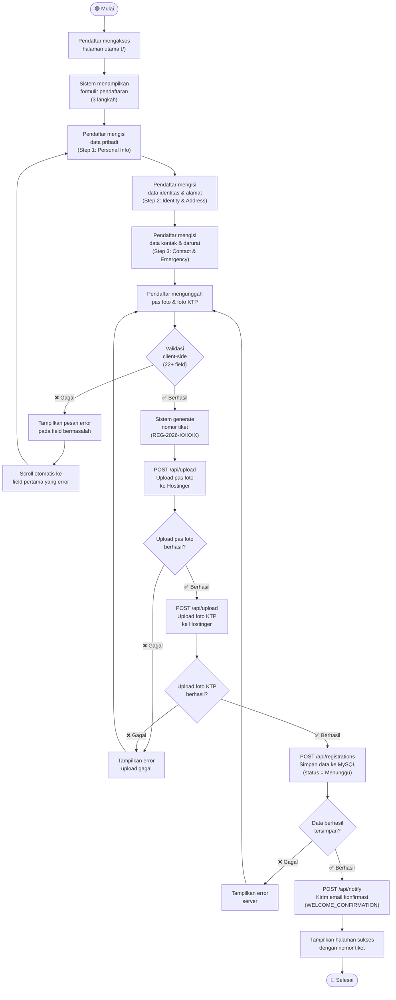

---

## 3. Activity Diagram — Verifikasi Pendaftaran oleh Admin

> Alur proses admin memverifikasi (approve/reject) pendaftaran anggota.

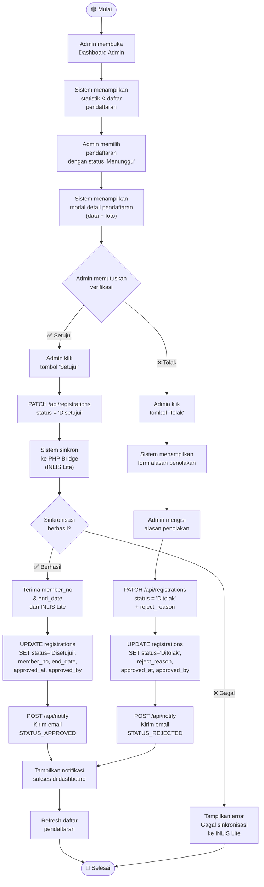

---

## 4. Activity Diagram — Cek Status Pendaftaran

> Alur proses pengecekan status pendaftaran oleh pendaftar.

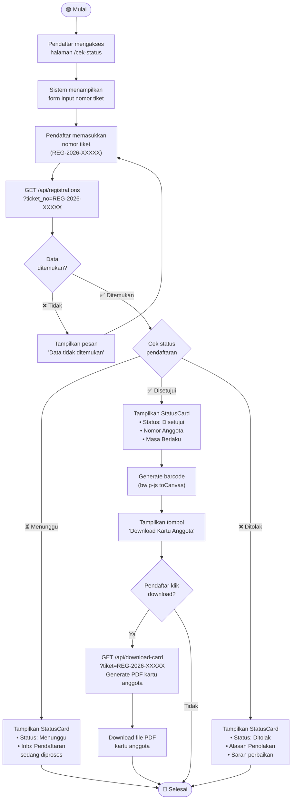

---

## 5. Activity Diagram — Login Admin

> Alur autentikasi admin/petugas ke dashboard.

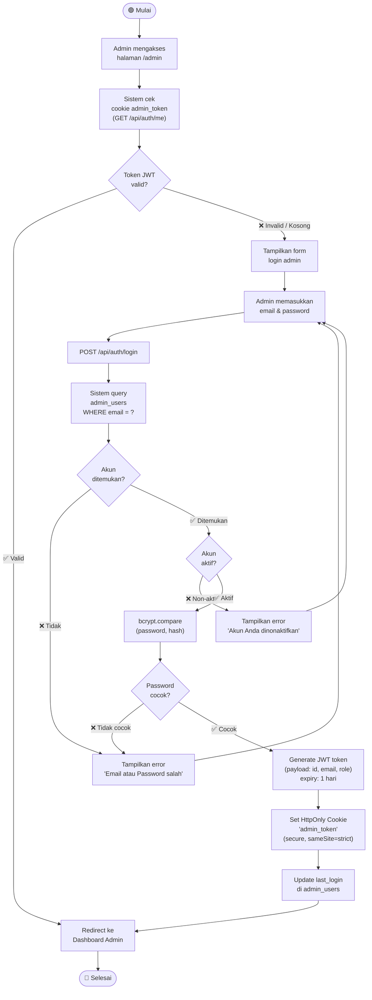

---

## 6. Class Diagram

> Struktur kelas/entitas utama dalam sistem beserta atribut, method, dan relasi.

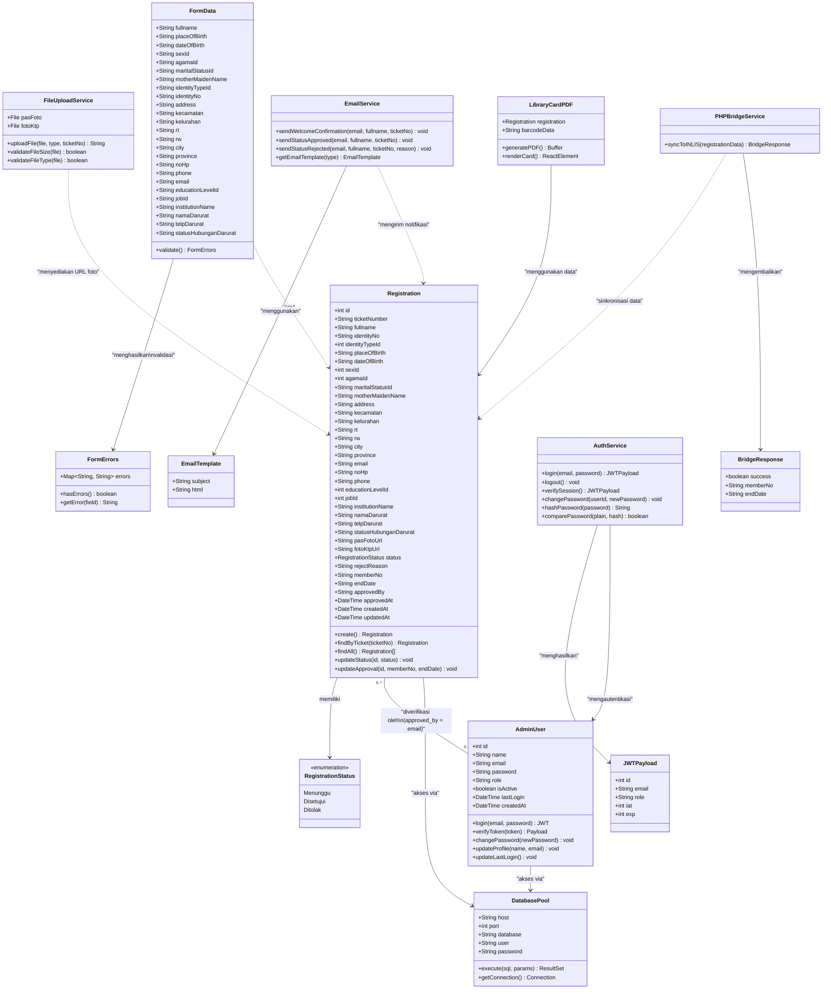

---

## 7. Sequence Diagram — Pendaftaran Anggota

> Menggambarkan interaksi detail antar komponen saat proses pendaftaran.

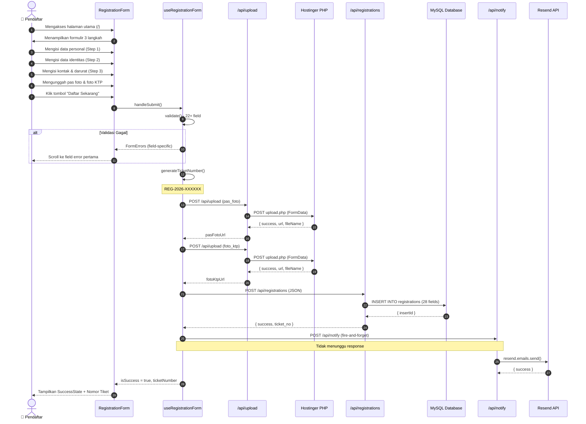

---

## 8. Sequence Diagram — Approval Pendaftaran

> Menggambarkan interaksi saat admin menyetujui pendaftaran dan sinkronisasi ke INLIS Lite.

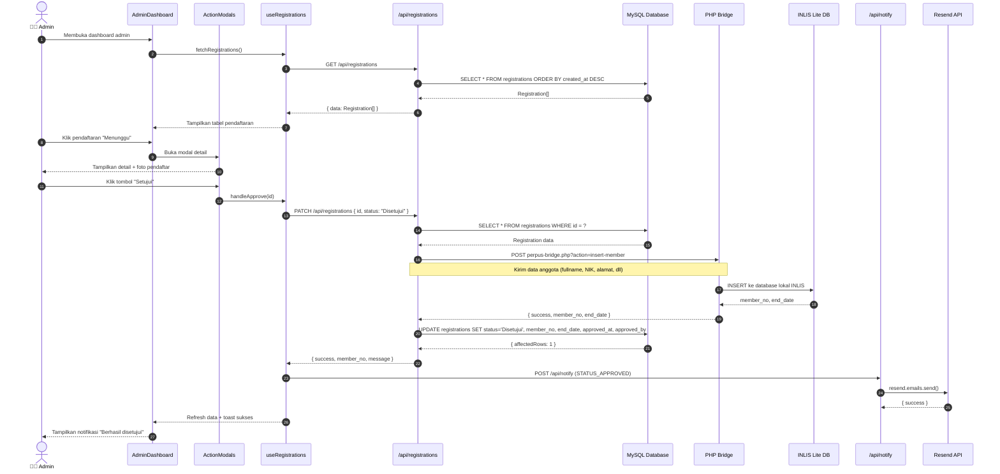

---

## 9. ERD (Entity Relationship Diagram)

> Struktur database sistem dengan detail kolom dan tipe data.

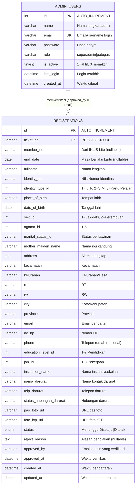

> [!NOTE]
> Relasi antara `REGISTRATIONS.approved_by` dan `ADMIN_USERS.email` bersifat **logis/referensial** — tidak ada foreign key eksplisit di database. Sistem hanya menggunakan 2 tabel.

---

## 10. Component Diagram

> Arsitektur komponen teknis sistem dengan layer-layer yang jelas.

```mermaid
flowchart TB
    subgraph Client["🖥️ Presentation Layer (React/Next.js)"]
        direction TB
        subgraph Pages["Pages"]
            Landing["📄 page.tsx\n(Landing / Form)"]
            CekStatusPage["📄 cek-status/page.tsx"]
            AdminPage["📄 admin/page.tsx"]
        end
        subgraph Components["Komponen UI"]
            RegForm["📦 RegistrationForm"]
            FormSec["📦 FormSections\n(6 section)"]
            FileUp["📦 FileUploadSection"]
            Success["📦 SuccessState"]
            Navbar["📦 Navbar"]
            CekStatusComp["📦 CekStatus"]
            StatusCard["📦 StatusCard"]
            AdminDash["📦 AdminDashboard"]
            RegTable["📦 RegistrationTable"]
            ActionModal["📦 ActionModals"]
            Stats["📦 StatsOverview"]
            UserMgmt["📦 UserManagement"]
            Profile["📦 ProfileSettings"]
            PDFCard["📦 LibraryCardPDF"]
        end
        subgraph UI["UI Primitives"]
            ProgressSteps["🎨 ProgressSteps"]
            StatusBadge["🎨 StatusBadge"]
            Toast["🎨 Toast"]
        end
    end

    subgraph Hooks["⚡ Business Logic Layer (Custom Hooks)"]
        useRegForm["🔧 useRegistrationForm\n• Validasi 22+ field\n• Orchestrate submit"]
        useRegs["🔧 useRegistrations\n• CRUD admin\n• Approve/Reject"]
        useStatus["🔧 useStatusSearch\n• Cari status\n• Generate barcode"]
    end

    subgraph API["🔌 API Layer (Next.js Route Handlers)"]
        direction TB
        subgraph PublicAPI["Public Endpoints"]
            ApiReg["POST /api/registrations\nGET /api/registrations?ticket_no="]
            ApiUpload["POST /api/upload"]
            ApiNotify["POST /api/notify"]
            ApiDownload["GET /api/download-card"]
            ApiProxy["GET /api/proxy-image"]
        end
        subgraph AuthAPI["Auth Endpoints"]
            ApiLogin["POST /api/auth/login"]
            ApiMe["GET /api/auth/me"]
            ApiLogout["POST /api/auth/logout"]
            ApiChangePw["POST /api/auth/change-password"]
            ApiSeed["GET /api/auth/seed"]
        end
        subgraph AdminAPI["Admin-Only Endpoints"]
            ApiRegPatch["PATCH /api/registrations"]
            ApiUsers["CRUD /api/admin/users"]
            ApiProfile["GET|PUT /api/admin/profile"]
        end
    end

    subgraph Middleware["🛡️ Middleware Layer"]
        MW["middleware.ts\nJWT Verification\nRoute Protection"]
    end

    subgraph Shared["📚 Shared Layer"]
        DB["lib/db.ts\nMySQL Pool"]
        Constants["lib/constants.ts\nConfig & Regex"]
        EmailTPL["lib/emailTemplates.ts\n3 HTML Templates"]
        Types["types/index.ts\nTypeScript Interfaces"]
    end

    subgraph External["🌐 External Services"]
        MySQL[("🗄️ MySQL\nHostinger")]
        Hostinger["📁 Hostinger\nFile Storage"]
        Resend["📧 Resend API"]
        PHPBridge["🔗 PHP Bridge\nINLIS Lite"]
    end

    %% Page to Component
    Landing --> RegForm
    CekStatusPage --> CekStatusComp
    AdminPage --> AdminDash

    %% Component to Hook
    RegForm --> useRegForm
    CekStatusComp --> useStatus
    AdminDash --> useRegs

    %% Hook to API
    useRegForm --> ApiUpload
    useRegForm --> ApiReg
    useRegForm --> ApiNotify
    useRegs --> ApiReg
    useRegs --> ApiRegPatch
    useRegs --> ApiNotify
    useStatus --> ApiReg

    %% Middleware intercepts
    MW -.->|"protects"| AdminAPI
    MW -.->|"protects"| ApiRegPatch

    %% API to External
    ApiReg --> DB
    ApiRegPatch --> DB
    ApiRegPatch --> PHPBridge
    ApiUpload --> Hostinger
    ApiNotify --> Resend
    ApiDownload --> DB
    ApiLogin --> DB
    ApiUsers --> DB
    ApiProfile --> DB
    DB --> MySQL

    %% API to Shared
    ApiNotify --> EmailTPL
```

---

## 11. Deployment Diagram

> Infrastruktur dan distribusi deployment sistem.

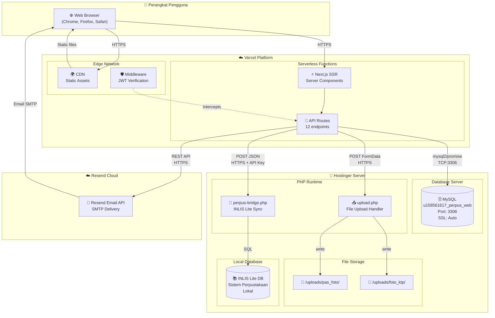

---

## 12. State Machine Diagram — Status Pendaftaran

> Transisi status pendaftaran dari awal hingga akhir.

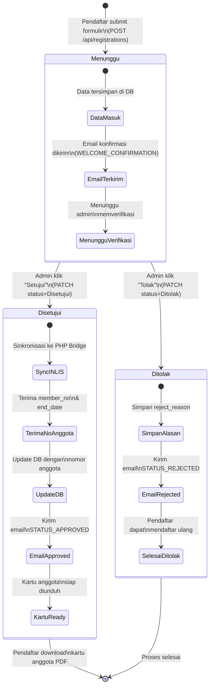

---

## Catatan Teknis

> [!IMPORTANT]
> **Limitasi Mermaid untuk Use Case Diagram:**
> Mermaid tidak memiliki tipe diagram Use Case resmi (seperti PlantUML). Diagram Use Case di atas diimplementasikan menggunakan `flowchart` sebagai pendekatan terbaik yang tersedia. Untuk diagram Use Case yang persis seperti contoh gambar (dengan oval dan stick figure), disarankan menggunakan tools seperti:
> - **Draw.io** (gratis)
> - **StarUML**
> - **PlantUML**
> - **Visual Paradigm**

> [!TIP]
> **Cara Render Diagram Mermaid:**
> 1. **VS Code**: Install ekstensi "Markdown Preview Mermaid Support"
> 2. **Online**: Buka [mermaid.live](https://mermaid.live) dan paste kode diagram
> 3. **GitHub**: Langsung render di file markdown GitHub
> 4. **Export**: Gunakan [mermaid.live](https://mermaid.live) untuk export sebagai PNG/SVG

---

## Rekomendasi Diagram Tambahan untuk Laporan Magang

| No | Diagram | Alasan | Prioritas |
|----|---------|--------|-----------|
| 1 | **Flowchart Sistem Keseluruhan** | Gambaran umum alur sistem dari awal hingga akhir | ⭐⭐⭐ |
| 2 | **Data Flow Diagram (DFD)** | Menunjukkan aliran data antar proses, cocok untuk laporan formal | ⭐⭐⭐ |
| 3 | **Arsitektur Sistem (Block Diagram)** | Menggambarkan arsitektur monolith full-stack yang digunakan | ⭐⭐⭐ |
| 4 | **Sitemap / Navigation Diagram** | Struktur halaman dan navigasi website | ⭐⭐ |
| 5 | **Wireframe / Mockup** | Tampilan visual halaman-halaman utama | ⭐⭐ |
| 6 | **Gantt Chart** | Timeline pengerjaan proyek selama magang | ⭐⭐ |

> Diagram 1-6 di atas sudah **tercakup sebagian** dalam file [arsitektur_teknis.md](file:///d:/project/pendaftaran-perpus-batang/arsitektur_teknis.md) namun belum dalam format diagram formal. Untuk laporan magang, diagram **Use Case, Activity, Class, Sequence, dan ERD** adalah yang paling standar dan wajib ada.
